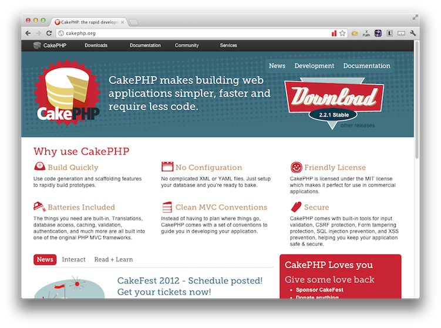
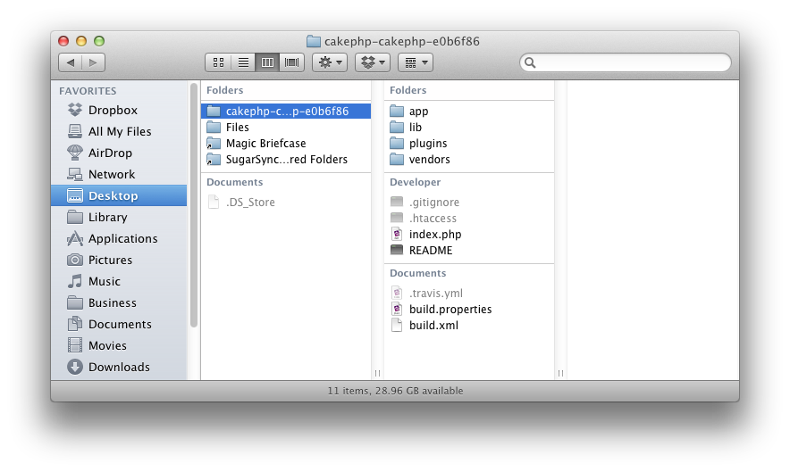
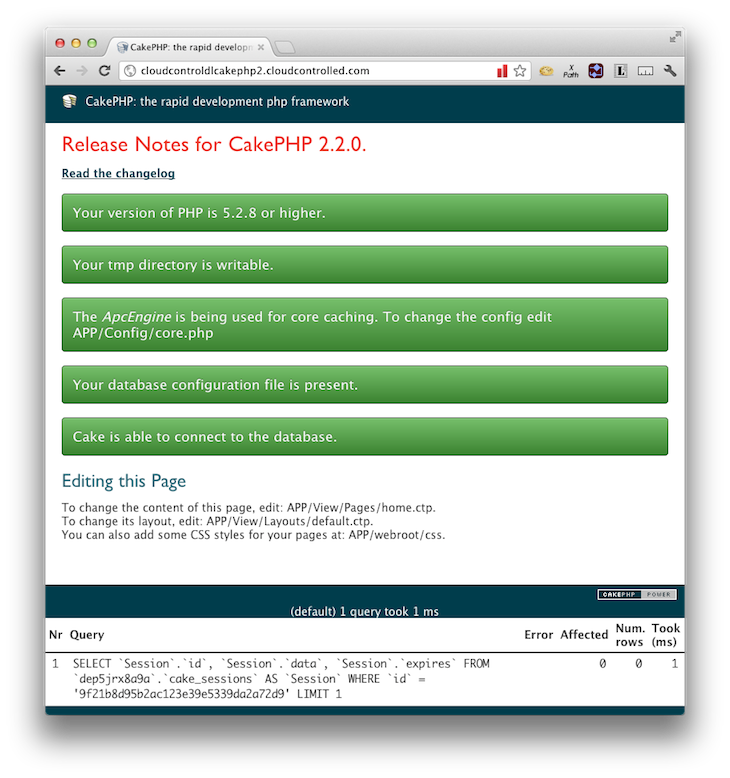
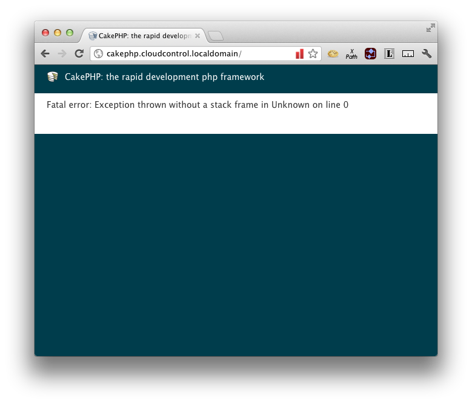

#Deploying CakePHP 2.2.1

If you're looking for a fast, light and effective PHP Framework for your projects, you can't go past [CakePHP](http://cakephp.org/). Now at [version 2.2.1](https://github.com/cakephp/cakephp/zipball/2.2.1) it comes with a variety of features to speed up your application development, including:

 * Baked in Security
 * Clear MVC approach
 * A large, thriving, community
 * Loads of plugins and add-ons
 * Easy to read documentation

In this tutorial, we're going to take you through deploying CakePHP v2.2.1 to [the cloudControl platform](http://www.cloudcontrol.com). 

##Prerequisites

You're going to need only a few things to following along with this tutorial. These are:

 * A [Git client](http://git-scm.com/), whether command-line or GUI.
 * A MySQL client, whether command-line or GUI, such as [MySQL Workbench](http://dev.mysql.com/downloads/workbench/) or the command-line tools.

##1. Grab a Copy of CakePHP 

So now that you have the prerequisites in place, download a copy of the latest, stable, release, 2.2.1 at the time or publishing. You can find it at: [https://github.com/cakephp/cakephp/zipball/2.2.1](https://github.com/cakephp/cakephp/zipball/2.2.1). After that, extract it to your local file sytem. 

If you use an IDE, then it's best to open up the source as a project in it. In this tutorial, I'm using SublimeText2.

##2. Amend the Code

A few changes need to be made to the default CakePHP configuration and code to accommodate cloudControl deployment. These changes are as follows:

 * Store session and log files in a database, not on the filesystem
 * Auto-magically determine the environment and set the configuration

###2.1 Store session and log files in a database, not on the filesystem

We need to do this because CakePHP, by default, stores its session files on the filesystem. However, this approach isn’t recommended on cloud platforms like cloudControl.

What's more, storing files in a multi-server environment can lead to hard to debug issues. So what we're going to do is to store both the session and log files in a two-level cache, composed of MySQL and APC. 

Thankfully, CakePHP is written in a very straight-forward and configurable manner, so this is easy to do. What's more, the community around it is very healthy, so there's loads of options and support available. 

###2.2 Auto-magically determine the environment and set the configuration

As each environment will, likely, have different configuration settings, we also need to be able to differentiate between them. CakePHP does do this out of the box, but it's done by using different bootstrap files, such as **index.php**, **index-test.php** and so on. 

On cloudControl, an app should programmatically know where it is and set the appropriate configuration options. That way, your code will run in every environment. So we're going to be making additions to the code so this happens auto-magically.

##3. Put the Code under Git Control

Ok, now let's get started making these changes and deploying the application. We'll begin by putting it under Git control. So run the following command to do that:

    cd <your CakePHP directory>
    
    git init .
    
    git add -A
    
    git commit -m "First addition of the source files"
    
Now that the code's under version control, we're going to create a testing branch as well, so that we have one to test with and one for production. Run the following command and it will be done:

    git checkout -b testing
    
If you're not familiar with Git, the previous command will checkout a copy of our existing branch, into a new branch, called *testing*. You can confirm that you now have two branches, by running the following command:

    git branch
    
That will show output similar to below:

    $ git branch
        master
        * testing

I am using the application name ``cloudcontrolledcakephp`` in this example. You will of course have to use some different name. 
Now, we need to make our first deployment of both branches to the cloudControl platform. To do this we checkout the master branch, create the application in our cloudControl account and push and deploy both deployments. 
By running the following commands, this will all be done:

    // switch to the master branch
    git checkout master
    
    // create the application
    cctrlapp cloudcontrolledcakephp create php
    
    // deploy the default branch
    cctrlapp cloudcontrolledcakephp/default push    
    cctrlapp cloudcontrolledcakephp/default deploy 
    
    // deploy the testing branch
    cctrlapp cloudcontrolledcakephp/testing push    
    cctrlapp cloudcontrolledcakephp/testing deploy 

##4. Initialise the Required Add-ons

Now that that's done, we need to configure two add-ons, config and mysqls. The config add-on is required to determine the active environment and mysqls is used for storing our session and logging information. 

###4.1 Check the Add-on Configuration

Now let's be sure that everything is in order by having a look at the add-on configuration output, in this case for testing. To do that, run the command below:

    // Initialise the mysqls.free addon for the default deployment
    cctrlapp cloudcontrolledcakephp/default addon.add mysql.free
    
    // Retrieve the settings
    cctrlapp cloudcontrolledcakephp/default addon mysql.free

    // Initialise the mysqls.free addon for the testing deployment
    cctrlapp cloudcontrolledcakephp/testing addon.add mysql.free
    
    // Retrieve the settings
    cctrlapp cloudcontrolledcakephp/testing addon mysql.free

The output of the commands will be similar to that below:

    Addon                    : mysqls.free
       
     Settings
       MYSQLS_DATABASE          : <database_name>
       MYSQLS_PASSWORD          : <database_password>
       MYSQLS_PORT              : 3306
       MYSQLS_HOSTNAME          : mysqlsdb.co8hm2var4k9.eu-west-1.rds.amazonaws.com
       MYSQLS_USERNAME          : <database_username>

###4.2 Initialising config

Now we need to configure the config add-on and store the respective environment setting in it. So run the following commands to do this:

    // Set the default environment setting
    cctrlapp cloudcontrolledcakephp/default config.add CAKE_ENV=production

    // Set the testing environment setting    
    cctrlapp cloudcontrolledcakephp/testing config.add CAKE_ENV=testing

Now that this is done, we're ready to make some changes to our code to make use of the new configuration. 

##5. Environment Configuration

So firstly, we're going to extend the bootstrap process to be able to determine which environment is being used. Create a new file under **Lib**, called ``BaseConfig.php`` and add in the code below. Have a look at it and we'll go through it together.

###5.1 Lib/BaseConfig.php

We then create a new class, **BASE_CONFIG**, that the database config, will later inherit from, and indicate that we have 4 environments: **default, development, testing** and **production**. 
    
    class BASE_CONFIG {
    
        var $environments = array('default', 'development', 'testing', 'production');
        var $default = array();

In the function, ``getEnvironmentName``, if we're not in a local, development, environment, as indicated by having '**localdomain**' in the URL, we retrieve [the credentials file](https://github.com/cloudControl/add_on_cred_file/blob/master/_config.php) from the environment, which is part of a standard cloudControl deployment.

We then look in there for a value called **CAKE_ENV**, which determines the active environment and we store that in an application environment setting and return the value determined.

    <?php
    
    function getEnvironmentName() 
    {
        if (!empty($_SERVER['HTTP_HOST']) && strpos($_SERVER['HTTP_HOST'], 'localdomain') === FALSE) {
            // Parse the json file with ADDONS credentials
            $string = file_get_contents($_ENV['CRED_FILE'], false);

            if ($string == false) {
                die('FATAL: Could not read credentials file');
            }

            $creds = json_decode($string, true);

            // Set CAKE_ENV from the $creds-array
            Configure::write('Environment.name', $creds['CONFIG']['CONFIG_VARS']['CAKE_ENV']);
        } else {
            Configure::write('Environment.name', 'development');
        }
        $environment = (String)Configure::read('Environment.name');
        return $environment;
    }
     
Now that we're able to know the environment that we're operating in, we setup the database configuration appropriately. If we're in development, then we use the development configuration in ``app/Config/database.php``. If we're not, then we retrieve the options from the ``CRED_FILE`` that is available to all cloudControl environments. 

When we configured the add ons earlier (*mysqls* and *config*) the settings were automatically persisted to the running server environments. So we're now able to retrieve these settings, when we're not in a local development environment, and configure our database connection to use them. It's really handy as we don't need to do too much to make use of the options.

    <?php
    
    function __construct() 
    {
        $environment = $this->getEnvironmentName();
        if ($environment && isset($this->{$environment})) {
            
            if ($environment !== 'development') {
                // read the credentials file
                $string = file_get_contents($_ENV['CRED_FILE'], false);
                if ($string == false) {
                    die('FATAL: Could not read credentials file');
                }

                // the file contains a JSON string, decode it and return an associative array
                $this->_creds = json_decode($string, true);
                $this->default = array(
                    'datasource' => 'Database/Mysql',
            		'persistent' => false,
            		'host' => $this->_creds["MYSQLS"]["MYSQLS_HOSTNAME"],
            		'login' => $this->_creds["MYSQLS"]["MYSQLS_USERNAME"],
            		'password' => $this->_creds["MYSQLS"]["MYSQLS_PASSWORD"],
            		'database' => $this->_creds["MYSQLS"]["MYSQLS_DATABASE"],
            		'prefix' => '',
            		'encoding' => 'utf8',
                );
            } else {
                $this->default = array_merge($this->default, $this->{$environment});        
            }
            
            if ($environment == 'testing') {
                Configure::write('debug', 2);
            }
        } else {
            $this->default = $this->development;
            Configure::write('debug', 2);
        }
    }

Now, we need to configure the development environment database settings, using the settings. So open up ``app/Config/database.php`` and change the class to extend from our newly created **BASE_CONFIG** class. Then add in the database settings for your local development environment database. With these files in place, we have configurations for development and the running configurations.  

An example is provided below: 

    <?php

    class DATABASE_CONFIG extends BASE_CONFIG 
    {
        protected $_creds; 
        
    	public $development = array(
    		'datasource' => 'Database/Mysql',
    		'persistent' => false,
    		'host' => 'localhost',
    		'login' => 'cc_dev',
    		'password' => 'cc _dev',
    		'database' => 'cloudcontrol_cakephp',
    		'prefix' => '',
    		'encoding' => 'utf8',
    	);
    }

###5.2 app/Config/bootstrap.php

The bootstrap file is the core file managing the bootstrap process in CakePHP. By default, caching is using the filesystem as storage. What we're going to do is to make use of the built-in APC module that comes with cloudControl and store the cache information there. We could use Memcache, but for the purposes of this tutorial, we'll be using APC.

Go down in the file until you find a line similar to below:

    Cache::config('default', array(
    	'engine' => 'File', //[required]

Then replace it with the configuration below

    Cache::config('default', array(
    	'engine' => 'APC', 
    	'duration'=> 3600, 
    	'probability'=> 100, 
    	'prefix' => Inflector::slug(APP_DIR) . '_', 
    ));
    
After that, head on down further until you find a line similar to below:

    CakeLog::config('default', 
    	array(
    		'engine' => 'File', 

Change it so that it instead looks like the code below:
    
    /**
     * Configures default file logging options
     */
    App::uses('CakeLog', 'Log');
    CakeLog::config('default', 
    	array(
    		'engine' => 'DatabaseLogger', 
    		'model' => 'LogEntry'
    ));

This will tell it to use a class called DatabaseLogger and form the basis of telling it to store log information in the database.  Now, clone a copy of the DatabaseLogger library by running the following commands: 

    cd app/Plugin;
    
    git clone https://github.com/webtechnick/CakePHP-DatabaseLogger-Plugin database_logger

Now you'll have a copy of the files, ready to go.

###5.3 app/Config/core.php

To get the session information to be stored in the database, open up app/Config/core.php and add in the following code:

    Configure::write('Session', array(
        'defaults' => 'database',
        'handler' => array(
            'engine' => 'ComboSession',		// class name
            'model' => 'cake_sessions',			// database table name
            'cache' => 'APC'
        )
    ));
    
    // Make sure to add a APC cache config
    Cache::config('APC', array('Engine' => 'APC'));

What this does is to have a two-level cache. The information is stored in both APC and the database. This allows us to retrieve the information from APC, which is far faster than MySQL, but has less available space. If the information's not there, then we search for it in MySQL. 

###5.4 Model/Datasource/Session/ComboSession.php

Next, create the file ``ComboSession.php`` in ``Model/Datasource/Session``. And set it up as below. 

    <?php
    App::uses('DatabaseSession', 'Model/Datasource/Session');
    
    class ComboSession extends DatabaseSession implements CakeSessionHandlerInterface {
        public $cacheKey;
    
        public function __construct() {
            $this->cacheKey = Configure::read('Session.handler.cache');
            parent::__construct();
        }
    
        // read data from the session.
        public function read($id) {
            $result = Cache::read($id, $this->cacheKey);
            if ($result) {
                return $result;
            }
            return parent::read($id);
        }
    
        // write data into the session.
        public function write($id, $data) {
            $result = Cache::write($id, $data, $this->cacheKey);
            if ($result) {
                return parent::write($id, $data);
            }
            return false;
        }
    
        // destroy a session.
        public function destroy($id) {
            $result = Cache::delete($id, $this->cacheKey);
            if ($result) {
                return parent::destroy($id);
            }
            return false;
        }
    
        // removes expired sessions.
        public function gc($expires = null) {
            return Cache::gc($this->cacheKey) && parent::gc($expires);
        }
    }

What this does is to extend the DatabaseSession class so that we can use both APC and MySQL to store session information. With these file amendments in place, we're just about ready to go. So in your Git client, stage the files ready to be committed. 

##6. Database Schema

Ok, next we need to create a basic database schema for storing both the session and log information. To save time, add the following to a SQL file called ``cakephp_cloudcontrol_init.sql``, ready to be used to initialise the database next. 

    CREATE TABLE `cake_sessions` (
      `id` varchar(255) NOT NULL DEFAULT '',
      `data` text,
      `expires` int(11) DEFAULT NULL,
      PRIMARY KEY (`id`)
    ) ENGINE=MyISAM DEFAULT CHARSET=latin1;
    
    CREATE TABLE `log_entries` (
      `id` int(10) unsigned NOT NULL AUTO_INCREMENT,
      `type` varchar(45) DEFAULT NULL,
      `message` text,
      `time` int(11) NOT NULL,
      `datetime` datetime NOT NULL,
      `ip` int(11) NOT NULL,
      `url` varchar(255) NOT NULL,
      PRIMARY KEY (`id`),
      KEY `type` (`type`),
      KEY `ip` (`ip`),
      KEY `url` (`url`),
      KEY `time` (`time`),
      KEY `datetime` (`datetime`)
    ) ENGINE=InnoDB DEFAULT CHARSET=latin1;
    
    CREATE TABLE `logs` (
      `id` int(11) unsigned NOT NULL AUTO_INCREMENT,
      `type` varchar(20) NOT NULL,
      `time` datetime NOT NULL,
      `message` text NOT NULL,
      PRIMARY KEY (`id`)
    ) ENGINE=MyISAM DEFAULT CHARSET=latin1;

Now, in the shell, we're going to load the data in to the remote mysql instance that we created earlier. To do so, run the following command, changing the respective options with your configuration settings, doing this for both default and testing:

    mysql -u <database_username> -p \
        -h mysqlsdb.co8hm2var4k9.eu-west-1.rds.amazonaws.com \
        --ssl-ca=mysql-ssl-ca-cert.pem <database_name> < cakephp_cloudcontrol_init.sql

In the command above, you can see a reference to a **.pem** file. This can be downloaded from: [http://s3.amazonaws.com/rds-downloads/mysql-ssl-ca-cert.pem](http://s3.amazonaws.com/rds-downloads/mysql-ssl-ca-cert.pem). All being well, the command will finish silently, loading the data. You can check that all's gone well with following commands:

    mysql -u <database_username> -p \
        -h mysqlsdb.co8hm2var4k9.eu-west-1.rds.amazonaws.com \
        --ssl-ca=mysql-ssl-ca-cert.pem <database_name>
    
    show tables;
    
This will show you the tables from the SQL file. 

Now that that's done, commit the changes we made earlier and push and deploy both environments again so that the new information will be used. This can be done quickly with the following commands:

    // commit the changes
    git commit -m "changed to store log and session in mysql and auto-determine environment"

    // deploy the default branch
    cctrlapp cloudcontrolledcakephp/default push    
    cctrlapp cloudcontrolledcakephp/default deploy
    
    git checkout testing
    git merge master
    
    // deploy the testing branch
    cctrlapp cloudcontrolledcakephp/testing push    
    cctrlapp cloudcontrolledcakephp/testing deploy

##7. Review the Deployment

With that completed, then have a look at both your deployments to ensure that they're working. 

You should see output similar to that below, in figure 2.

###7.1 Deployment Problems

If you see output similar to figure 3, then double check your database configuration settings and run through commit and deploy again.

With that, you should be up and running, ready to create your next, amazing, PHP web application, using CakePHP. If you want to save yourself some time, you can clone a copy of the modified CakePHP source from the cloudControl Github repository. If you have any issues, feel free to email [support@cloudcontrol.com](mailto:support@cloudcontrol.com).

##Links
 
 * [http://www.dereuromark.de/2010/08/17/development-vs-productive-setup/](http://www.dereuromark.de/2010/08/17/development-vs-productive-setup/)
 * [http://book.cakephp.org/2.0/en/development/sessions.html](http://book.cakephp.org/2.0/en/development/sessions.html)
 * [http://php.refulz.com/cakephp-error-the-requested-address-was-not-found-on-this-server/](http://php.refulz.com/cakephp-error-the-requested-address-was-not-found-on-this-server/)
 * [http://bakery.cakephp.org/articles/stevena0/2010/08/29/use-different-configs-for-different-environments](http://bakery.cakephp.org/articles/stevena0/2010/08/29/use-different-configs-for-different-environments)
 * [http://www.jamesfairhurst.co.uk/posts/view/using_the_database_for_sessions_in_cakephp/](http://www.jamesfairhurst.co.uk/posts/view/using_the_database_for_sessions_in_cakephp/)
 * [https://bitbucket.org/sebnil/cakephp-database-logger/wiki/Home](https://bitbucket.org/sebnil/cakephp-database-logger/wiki/Home)
