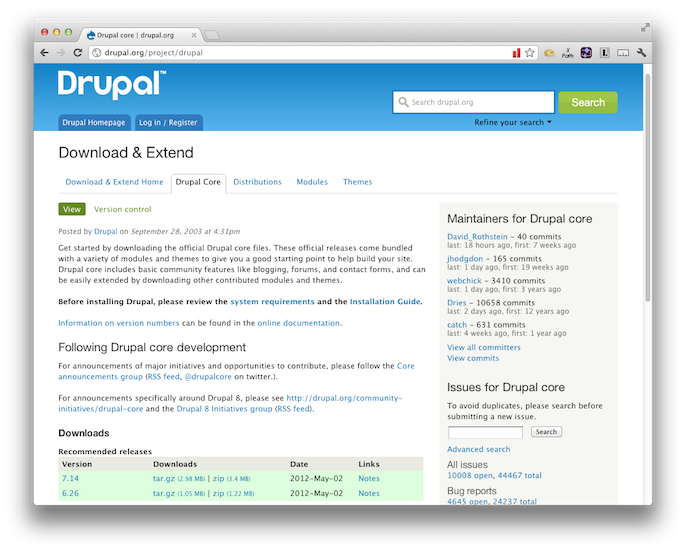
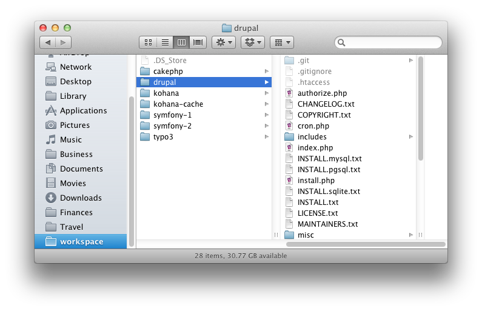
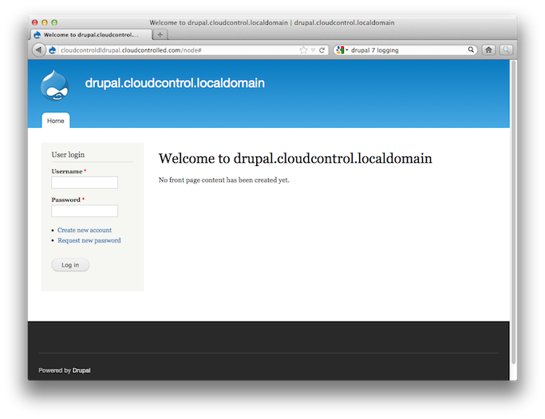

#Deploying Drupal 7

If you're looking for a flexible, friendly and powerful content management platform, built in PHP, for your projects, you really can't go past [Drupal](http://drupal.org/). Having been consistently growing and evolving since it was first created by Dries Buytaert in January 2001, Drupal 7 is the latest iteration and comes packed with a variety of features to speed up your application development, including:

 * A host of core and third party modules
 * Localised into 55 languages
 * A large, thriving, community
 * Auto-update notification
 * Easy to read documentation

In this tutorial, we're going to take you through deploying Drupal 7 to [the cloudControl platform](http://www.cloudcontrol.com).

##Prerequisites

You're going to need only a few things to following along with this tutorial. These are:

 * A [Git client](http://git-scm.com/), whether command-line or GUI.
 * A MySQL client, whether command-line or GUI, such as [MySQL Workbench](http://dev.mysql.com/downloads/workbench/) or the command-line tools.

##1. Grab a Copy of Drupal 7. 

So now that you have the prerequisites in place, download a copy of the latest, stable, release, 7.14 at the time or publishing. You can find it at: [http://ftp.drupal.org/files/projects/drupal-7.14.tar.gz](http://ftp.drupal.org/files/projects/drupal-7.14.tar.gz). After that, extract it to your local filesystem. 

After this, in your local development environment, perform a standard installation of Drupal, as covered in the [online installation documentation](http://drupal.org/documentation/install). 

##2. Amend the Code

A few changes need to be made to the default Drupal 7 configuration. These changes are as follows:

###2.1 Auto-Magically Determine the Environment and Configuration the Application

As is quite common in modern application development, we deploy to multiple environments, such as testing, staging and production. And each of these environments will, likely, have different configuration settings for the *database*, *caching* etc, so we need to be able to differentiate between them. Drupal does not automatically do this out of the box, but it's not that hard to adjust it to make it happen.

And luckily for us, Drupal 7, by default, stores most of its logging and session information automatically in the database. So we don't need to make many configuration changes there to make sure that it works. 

What is not being covered in this tutorial is connecting the installation to a writeable filesystem, such as [Amazon S3](http://aws.amazon.com/s3/). That will be done in a follow up to this tutorial.

##3. Put the Code Under Git Control

Ok, now let's get started making these changes and deploying the application. We'll begin by putting it under Git control. So run the following command to do that:

    cd <your Drupal 7 directory>
    
    git init .
    
    git add -A
    
    git commit -m "First addition of the source files"
    
Now that the code's under version control, we're going to create a testing branch as well, so that we have one to test with and one for production. Run the following command and it will be done:

    git checkout -b testing
    
If you're not familiar with Git, the previous command will checkout a copy of our existing branch, into a new branch, called **testing**. You can confirm that you now have two branches, by running the following command:

    git branch
    
That will show output similar to below:

    $ git branch
        master
        * testing

I am using the application name ``cloudcontroldldrupal`` in this example. You will of course have to use some different name. 
Now, we need to make our first deployment of both branches to the cloudControl platform. To do this we checkout the master branch, create the application in our cloudControl account and *push* and *deploy* both deployments. By running the following commands, this will all be done:

    // switch to the master branch
    git checkout master
    
    // create the application, indicating it's PHP-based
    cctrlapp cloudcontroldldrupal create php
    
    // deploy the default branch
    cctrlapp cloudcontroldldrupal/default push    
    cctrlapp cloudcontroldldrupal/default deploy
    
    // deploy the testing branch
    cctrlapp cloudcontroldldrupal/testing push    
    cctrlapp cloudcontroldldrupal/testing deploy

##4. Initialise the Required Addons

Now that that's done, we need to configure two add-ons, config and mysqls. The config add-on is required to determine the active environment and mysqls for storing our session and logging information. 

###4.1 Initialising mysqls

To initialise mysqls, run the following commands and make a note of the output:

    // Initialise the mysqls.free addon for the default deployment
    cctrlapp cloudcontroldldrupal/default addon.add mysql.free

    // Retrieve the settings
    cctrlapp cloudcontroldldrupal/default addon mysql.free

    // Initialise the mysqls.free addon for the testing deployment
    cctrlapp cloudcontroldldrupal/testing addon.add mysql.free

    // Retrieve the settings
    cctrlapp cloudcontroldldrupal/testing addon mysql.free

The output of the commands will be similar to that below:

    Addon                    : mysqls.free

     Settings
       MYSQLS_DATABASE          : <database_name>
       MYSQLS_PASSWORD          : <database_password>
       MYSQLS_PORT              : 3306
       MYSQLS_HOSTNAME          : mysqlsdb.co8hm2var4k9.eu-west-1.rds.amazonaws.com
       MYSQLS_USERNAME          : <database_username>

###4.2 Initialising config

Now we need to configure the config addon and store the respective environment setting in it. So run the following commands to do this:

    // Set the default environment setting
    cctrlapp cloudcontroldldrupal/default config.add APPLICATION_ENV=production

    // Set the testing environment setting
    cctrlapp cloudcontroldldrupal/testing config.add APPLICATION_ENV=testing

Now that this is done, we're ready to make some changes to our code to make use of the new configuration.

##5. Environment Configuration

Now we're going to extend the Drupal 7 bootstrap process to be able to determine which environment is being used, which we talked about earlier. To do that, open up ``sites/default/settings.php`` and add in the code below right at the end of the file. 

Have a look at it and we'll go through it together.

    $env = 'production';
    
    if (!empty($_SERVER['HTTP_HOST']) && strpos($_SERVER['HTTP_HOST'], 'localdomain') !== FALSE) {
       $env = 'development'; 
    }
    
    if (!empty($_SERVER['HTTP_HOST']) && strpos($_SERVER['HTTP_HOST'], 'localdomain') === FALSE) {
        // Parse the json file with ADDONS credentials
        $string = file_get_contents($_ENV['CRED_FILE'], false);
    
        if ($string == false) {
            die('FATAL: Could not read credentials file');
        }
    
        $creds = json_decode($string, true);
    
        // Now getenv('APPLICATION_ENV') should work:
        $env = $creds['CONFIG']['CONFIG_VARS']['APPLICATION_ENV'];
    }
    
    
    $local_settings = __DIR__ . "/settings.{$env}.inc"; 
    include($local_settings);

Firstly, we set the environment to default to production. Then, if we're in a local development environment, as determined, rather simply, by having ``localdomain`` in the URL, then we set the environment to development.

Otherwise, we will retrieve the setting contained in the cloudControl credentials file setting, **APPLICATION_ENV**, that we set earlier with the config addon, which should be one of '**production**' or '**testing**'.

With this code in place, we can now bootstrap multiple environments. Following this, we need to configure the database,.

##6. Configuring the Database

When we configured the add ons earlier (mysqls and config) the settings were automatically persisted to the running server environments. So we’re now able to retrieve these settings, when we’re not in a local development environment, and configure our database connection to use them automatically. 

It’s really handy as we don’t need to do too much to make use of the options.

Under **sites/default** create three new files:

 * ``settings.development.inc``
 * ``settings.testing.inc``
 * ``settings.production.inc``

In there, past the respective database settings for your different environments that you can retrieve from the database add-on configuration or your local development environment. 

Two examples are provided below: 

###6.1 Production

    <?php
    
    // read the credentials file
    $string = file_get_contents($_ENV['CRED_FILE'], false);
    if ($string == false) {
        die('FATAL: Could not read credentials file');
    }
    
    // the file contains a JSON string, decode it and return an associative array
    $creds = json_decode($string, true);
    
    $databases = array (
      'default' => array (
        'default' => array (
          'database' => $creds["MYSQLS"]["MYSQLS_DATABASE"],
          'username' => $creds["MYSQLS"]["MYSQLS_USERNAME"],
          'password' => $creds["MYSQLS"]["MYSQLS_PASSWORD"],
          'host' => $creds["MYSQLS"]["MYSQLS_HOSTNAME"],
          'port' => '',
          'driver' => 'mysql',
          'prefix' => '',
        ),
      ),
    );

###6.2 Testing

    <?php
    
    // read the credentials file
    $string = file_get_contents($_ENV['CRED_FILE'], false);
    if ($string == false) {
        die('FATAL: Could not read credentials file');
    }
    
    // the file contains a JSON string, decode it and return an associative array
    $creds = json_decode($string, true);
    
    $databases = array (
      'default' => array (
        'default' => array (
          'database' => $creds["MYSQLS"]["MYSQLS_DATABASE"],
          'username' => $creds["MYSQLS"]["MYSQLS_USERNAME"],
          'password' => $creds["MYSQLS"]["MYSQLS_PASSWORD"],
          'host' => $creds["MYSQLS"]["MYSQLS_HOSTNAME"],
          'port' => '',
          'driver' => 'mysql',
          'prefix' => '',
        ),
      ),
    );

###6.3 Database Schema

Ok, next we need to create a basic database schema for storing the session and log information as well as the other configuration and user data settings that Drupal stores. Download [the file](drupal_cloudcontrol_init.sql), ready to be used to initialise the database. 

Now, in the shell, we're going to load the data in to the remote mysql instance that we created earlier. To do so, run the following command, changing the respective options with your configuration settings, doing this for both **default** and **testing**:

    mysql -u <database_username> -p \
        -h mysqlsdb.co8hm2var4k9.eu-west-1.rds.amazonaws.com \
        --ssl-ca=mysql-ssl-ca-cert.pem <database_name> < drupal_cloudcontrol_init.sql

In the command above, you can see a reference to a **.pem** file. This can be downloaded from: [http://s3.amazonaws.com/rds-downloads/mysql-ssl-ca-cert.pem](http://s3.amazonaws.com/rds-downloads/mysql-ssl-ca-cert.pem). All being well, the command will finish silently, loading the data. You can check that all's gone well with following commands:

    mysql -u <database_username> -p \
        -h mysqlsdb.co8hm2var4k9.eu-west-1.rds.amazonaws.com \
        --ssl-ca=mysql-ssl-ca-cert.pem <database_name>
    
    show tables;
    
This should show you output similar to below:

Type 'help;' or '\h' for help. Type '\c' to clear the current input statement.

    mysql> show tables;
    +-----------------------------+
    | Tables_in_dep29a6hxt9       |
    +-----------------------------+
    | actions                     |
    | authmap                     |
    | batch                       |
    | block                       |
    | block_custom                |
    …
    | taxonomy_vocabulary         |
    | url_alias                   |
    | users                       |
    | users_roles                 |
    | variable                    |
    | watchdog                    |
    +-----------------------------+
    74 rows in set (0.06 sec)
    
    mysql>  

##7. Commit the Code Changes

Now that that's done, commit the changes we made earlier and push and deploy both environments again so that the new information will be used. This can be done quickly with the following commands:

    // commit the changes
    git commit -m "changed to store log and session in mysql and auto-determine environment"

    // deploy the default branch
    cctrlapp cloudcontroldlDrupal 7/default push    
    cctrlapp cloudcontroldlDrupal 7/default deploy
    
    git checkout testing
    git merge master
    
    // deploy the testing branch
    cctrlapp cloudcontroldlDrupal 7/testing push    
    cctrlapp cloudcontroldlDrupal 7/testing deploy

##8. Review the Deployment

With that completed, then you'll be able to have a look at both your deployments to ensure that they're working. 

You should see output similar to that below, in figure 2.

With that, you should be up and running, ready to create your next, amazing, PHP web application, using Drupal 7. If you have any issues, feel free to email [support@cloudcontrol.com](mailto:support@cloudcontrol.com).

