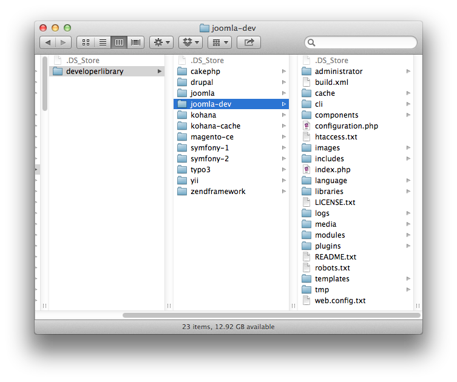
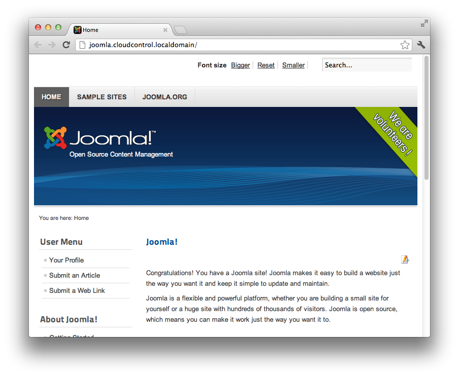

#Deploying Joomla 2.5 to cloudControl

If you're looking for a fast, light and effective PHP Framework for your projects, you can't go past [Joomla](http://www.joomla.org/download.html). Now at [version 2.5](http://www.joomla.org/download.html) it comes with a variety of features to speed up your application development, including:

 * Baked in Security
 * Clear MVC approach
 * A large, thriving, community
 * Loads of plugins and add-ons
 * Easy to read documentation

In this tutorial, we're going to take you through deploying Joomla v2.5 to [the cloudControl platform](http://www.cloudcontrol.com). 

##Prerequisites

You're going to need only a few things to following along with this tutorial. These are:

 * A [Git client](http://git-scm.com/), whether command-line or GUI.
 * A MySQL client, whether command-line or GUI, such as [MySQL Workbench](http://dev.mysql.com/downloads/workbench/) or the command-line tools.

##1. Grab a Copy of Joomla 

So now that you have the prerequisites in place, download a copy of the latest, stable, release. You can find it at: [http://www.joomla.org/download.html](http://www.joomla.org/download.html). After that, extract it to your local file sytem. 

##Create a Basic Application

Once you have a copy of the Joomla source available locally, setup a VHost (or equivalent) in your web server of choice and install a copy of it, accepting the default options and inserting your details as appropriate. If you're not that familiar with Joomla, the first time that you view it as a site it will run the installer. 

##2. Update the Configuration

A few changes need to be made to the default Joomla configuration and code to accommodate cloudControl deployment. These changes are as follows:

 * Store sessions in the database
 * Store Cache Information in APC
 * Update the Configuration Code

###2.1 Store Sessions in the Database

Unless something goes awry, you won't have to do anything here as Joomla should be configured to store session information in the database by default. But it bears double-checking, just to be sure. So, from "Global Configuration" -> "System" in the right hand side, do the following:

 * Under **Session Settings**:
     * ensure **Session Handler** is set to **Database**
 
Click Save.

###2.2 Store Cache Information in APC

By default, caching in Joomla is turned off. So from "Global Configuration" -> "System" in the right hand side, do the following:

 * Under **Cache Settings**:
     * set **Cache** to **On**
     * set **Cache Handler** to **Alternative PHP Cache**

Click **Save & Close**. 

###2.3 Update the Configuration Code

Joomla's core configuration file, ``configuration.php``, is updated whenever the details are changed in the administration panel as we just did. So, to retrieve the information from the cloudControl environment becomes a, little, bit tricky. 

What we can do, though an impermanent solution if we're upgrading our version of Joomla, is to update the file that is responsible for writing the configuration.php file, so that though a new constructor it can elect to return either the original information or the retrieve the database data from the environment and return that instead. 

We do this by updating ``libraries/joomla/registry/format/php.php``. Have a look at the modified version of the file below:

    <?php

    class JRegistryFormatPHP extends JRegistryFormat
    {

    	public function objectToString($object, $params = array())
    	{
    		// Build the object variables string
    		$vars = '';
    		foreach (get_object_vars($object) as $k => $v)
    		{
    			if (is_scalar($v))
    			{
    				$vars .= "\tpublic $" . $k . " = '" . addcslashes($v, '\\\'') . "';\n";
    			}
    			elseif (is_array($v) || is_object($v))
    			{
    				$vars .= "\tpublic $" . $k . " = " . $this->getArrayString((array) $v) . ";\n";
    			}
    		}
    
    		$str = "<?php\nclass " . $params['class'] . " {\n";
    		$str .= $vars;
    		
    		//
    		// Include in the generation of the class a call to the __get magic
    		// method, which will read the database settings from the environment
    		// and pass them when called for in code.
    		//
    		$str .= '
            public function __construct()
            {
                $creds = null;
        
                if (!empty($_SERVER[\'HTTP_HOST\']) && 
                    strpos($_SERVER[\'HTTP_HOST\'], \'localdomain\') === FALSE) {
        
                    $string = file_get_contents($_ENV[\'CRED_FILE\'], false);
                    if ($string == false) {
                        die(\'FATAL: Could not read credentials file\');
                    }
                    $creds = json_decode($string, true);
                    $this->host = $creds["MYSQLS"]["MYSQLS_HOSTNAME"];
                    $this->user = $creds["MYSQLS"]["MYSQLS_USERNAME"];
                    $this->db = $creds["MYSQLS"]["MYSQLS_DATABASE"];
                    $this->password = $creds["MYSQLS"]["MYSQLS_PASSWORD"];
                }
            }' . "\n";
    		
    		$str .= "}";
    
    		// Use the closing tag if it not set to false in parameters.
    		if (!isset($params['closingtag']) || $params['closingtag'] !== false)
    		{
    			$str .= "\n?>";
    		}
    
    		return $str;
    	}
    

##3. Put the Code Under Git Control

Ok, now let's get started making these changes and deploying the application. We'll begin by putting it under Git control. So run the following command to do that:

    cd <your Joomla directory>
    
    git init .
    
    git add -A
    
    git commit -m "First addition of the source files"
    
Now that the code's under version control, we're going to create a testing branch as well, so that we have one to test with and one for production. Run the following command and it will be done:

    git checkout -b testing
    
If you're not familiar with Git, the previous command will checkout a copy of our existing branch, into a new branch, called *testing*. You can confirm that you now have two branches, by running the following command:

    git branch
    
That will show output similar to below:

    $ git branch
        master
        * testing

I am using the application name ``cloudcontroldljoomla`` in this example. You will of course have to use some different name. 
Now, we need to make our first deployment of both branches to the cloudControl platform. To do this we checkout the master branch, create the application in our cloudControl account and push and deploy both deployments. By running the following commands, this will all be done:

    // switch to the master branch
    git checkout master

    // create the application
    cctrlapp cloudcontroldljoomla create php

    // deploy the default branch
    cctrlapp cloudcontroldljoomla/default push
    cctrlapp cloudcontroldljoomla/default deploy

    // deploy the testing branch
    cctrlapp cloudcontroldljoomla/testing push
    cctrlapp cloudcontroldljoomla/testing deploy

##4. Initialise the Required Add-ons

Now that that's done, we need to configure two add-ons, config and mysqls. The config add-on's required for determining the active environment and mysqls for storing our session and logging information. 

###4.1 Check the Add-on Configuration

Now let's be sure that everything is in order by having a look at the add-on configuration output, in this case for testing. To do that, run the command below:

    // Initialise the mysqls.free addon for the default deployment
    cctrlapp cloudcontroldljoomla/default addon.add mysql.free

    // Retrieve the settings
    cctrlapp cloudcontroldljoomla/default addon mysql.free

    // Initialise the mysqls.free addon for the testing deployment
    cctrlapp cloudcontroldljoomla/testing addon.add mysql.free

    // Retrieve the settings
    cctrlapp cloudcontroldljoomla/testing addon mysql.free

The output of the commands will be similar to that below:

    Addon                    : mysqls.free

     Settings
       MYSQLS_DATABASE          : <database_name>
       MYSQLS_PASSWORD          : <database_password>
       MYSQLS_PORT              : 3306
       MYSQLS_HOSTNAME          : mysqlsdb.co8hm2var4k9.eu-west-1.rds.amazonaws.com
       MYSQLS_USERNAME          : <database_username>

###4.2 Initialising config

Now we need to configure the config add-on and store the respective environment setting in it. So run the following commands to do this:

    // Set the default environment setting
    cctrlapp cloudcontroldljoomla/default config.add APPLICATION_ENV=production

    // Set the testing environment settings
    cctrlapp cloudcontroldljoomla/testing config.add APPLICATION_ENV=testing

Now that this is done, we're ready to make some changes to our code to make use of the new configuration. 

##5. A Note About Logging & Temp Directories

Where it may become interesting is if/when you start to use more than one clone for your application. We've had a good look at IRC, Joomla Forums and documentation and there doesn't appear to be simple way to store log information in the database, though we believe [JLog](http://docs.joomla.org/API16:JLog) is extendable. **So please bear this in mind.**

##6. Database Schema

Now, in the shell, we're going to dump the database that the install routine created and load it in to the remote mysql instance that we created earlier. To do so, run the following command, changing the respective options with your configuration settings, doing this for both default and testing:

    -- the database dump (SQL) file
    mysqldump -u <database_username> -p <database_name> > joomla_cloudcontrol_init.sql 

    -- load the database dump (SQL) file in to the remote environment database
    mysql -u <database_username> -p \
        -h mysqlsdb.co8hm2var4k9.eu-west-1.rds.amazonaws.com \
        --ssl-ca=mysql-ssl-ca-cert.pem <database_name> < joomla_cloudcontrol_init.sql

In the command above, you can see a reference to a **.pem** file. This can be downloaded from: [http://s3.amazonaws.com/rds-downloads/mysql-ssl-ca-cert.pem](http://s3.amazonaws.com/rds-downloads/mysql-ssl-ca-cert.pem). All being well, the command will finish silently, loading the data. You can check that all's gone well with following commands:

    mysql -u <database_username> -p \
        -h mysqlsdb.co8hm2var4k9.eu-west-1.rds.amazonaws.com \
        --ssl-ca=mysql-ssl-ca-cert.pem <database_name>
    
    show tables;
    
This will show you the tables from the SQL file. Now that that's done, commit the changes we made earlier and push and deploy both environments again so that the new information will be used. This can be done quickly with the following commands:

    // commit the changes
    git commit -m "changed to store log and session in mysql and auto-determine environment"

    // deploy the default branch
    cctrlapp cloudcontroldljoomla/default push    
    cctrlapp cloudcontroldljoomla/default deploy
    
    git checkout testing
    git merge master
    
    // deploy the testing branch
    cctrlapp cloudcontroldljoomla/testing push    
    cctrlapp cloudcontroldljoomla/testing deploy

##7. Review the Deployment

With that completed, then have a look at both your deployments to ensure that they're working. 
You should see output similar to that below, in figure 2.

###7.1 Deployment Problems

If you have any issues deploying the Joomla application, then please consult the log files. There are, currently, two available, these are **deploy** and **error**. As the names suggest, deploy provides an overview of the deployment process and error shows any and all PHP errors to the extend allowed by your current logging level.

To view the information, run the following commands respectively:

####7.1.1 Deployment

    cctrlapp cloudcontroldljoomla/default log deploy

####7.1.1 Errors

    cctrlapp cloudcontroldljoomla/default log error

The commands output information in a [UNIX tail](http://en.wikipedia.org/wiki/Tail_%28Unix%29) like fashion. So just call them and cancel the commend when you are no longer interested in the output. 

###7.2 Deployment Considerations

As was mentioned earlier, this isn't the most perfect solution as when you upgrade Joomla, the changes made to php.php will be overwritten and JLog still writes to the filesystem. We are working on a more permanent solution to this situation.

##Links
 
 * [Joomla](http://www.joomla.org/)
