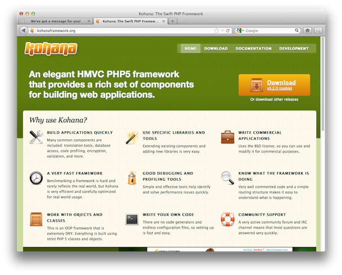
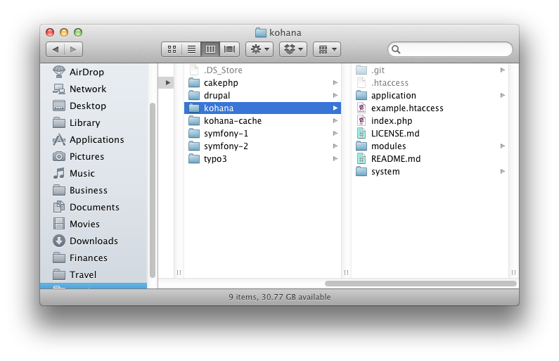
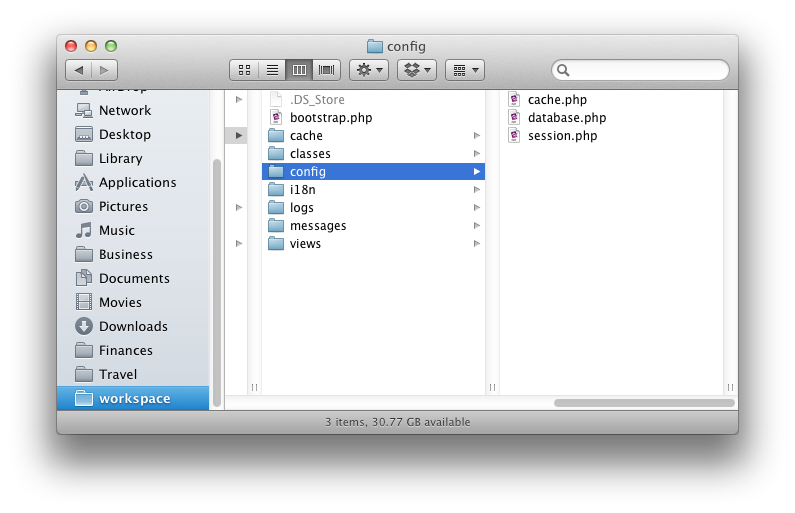
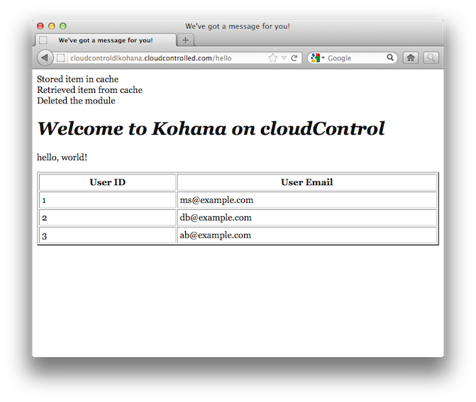

#Deploying Kohana 3.2.0

If you're looking for a very fast, light, highly configurable and effective PHP Framework for your projects, look no further than [Kohana](http://kohanaframework.org/). Now at [version 3.2.0](http://dev.kohanaframework.org/attachments/download/1670/kohana-3.2.0.zip) it comes with a variety of features to speed up your application development, including:

 * Excellent debugging and profiling tools
 * A flexible distribution license
 * A very active community
 * A set of core libraries
 * The ability to easily override and extend the core libraries
 * The ability to add in 3rd party libraries, such as Zend Framework
 * Rich [HMVC](http://en.wikipedia.org/wiki/Hierarchical_model%E2%80%93view%E2%80%93controller) support

In this tutorial, we're going to take you through deploying Kohana 3.2.0 to [the cloudControl platform](http://www.cloudcontrol.com). If you need further information about Kohana, check out [the online user guide](http://kohanaframework.org/documentation) or jump in to [the IRC channel](irc://irc.freenode.net/kohana). Otherwise, let's get started.

##Prerequisites

You're going to need only a few things to following along with this tutorial. These are:

 * A [Git client](http://git-scm.com/), whether command-line or GUI.
 * A MySQL client, whether command-line or GUI, such as [MySQL Workbench](http://dev.mysql.com/downloads/workbench/) or the command-line tools.

##1. Grab a Copy of the Kohana code. 

Now that you have the prerequisites in place, download a copy of the latest, stable, release, 3.2.0 at the time or publishing. You can find it at: [http://dev.kohanaframework.org/attachments/download/1670/kohana-3.2.0.zip](http://dev.kohanaframework.org/attachments/download/1670/kohana-3.2.0.zip). After that, extract it to your local filesystem. 

##2. Amend the Code

As I mentioned before, a few changes need to be made to the default Kohana configuration. These changes are as follows:

 1. Store Sessions in the Database
 2. Auto-Magically Determine the Environment and Set the Configuration

###2.1 Store Sessions in the Database

We need to do this because Kohana, by default, stores its session files on the filesystem. However, this approach isn't recommended on the cloudControl platform. 

What's more, storing files in a multi-server environment can lead to hard to debug issues. So what we're going to do is to store them in a MySQL database. 

Thankfully, Kohana is written in a very straight-forward and configurable manner, so this isn't too hard to do. What's more, the community around it is very healthy, so there's loads of options and support available when needed. 

###2.2 Auto-Magically Determine the Environment and Set the Configuration

As each environment will, likely, have different configuration settings, we also need to be able to differentiate between them. Kohana does do this out of the box, but it's done by using different bootstrap files, such as **index.php**, **index-test.php** and so on. 

On cloudControl, an app should programmatically know where it is and set the appropriate configuration options. That way, your code will run in every environment. So we're going to be making additions to the code so this happens auto-magically.

##3. Put the Code Under Git Control

Ok, now let's get started making these changes to the application. We'll begin by putting it [under Git control](http://git-scm.com/). So run the following command to do that:

    cd <your Kohana directory>
    
    git init .
    
    git add -A
    
    git commit -m "First addition of the source files"
    
Now that the code's under version control, we're going to create a testing branch as well, so that we have one to test with and one for production. Run the following command and it will be done:

    git checkout -b testing
    
If you're not familiar with Git, the previous command will checkout a copy of our existing branch, into a new branch, called *testing*. You can confirm that you now have two branches, by running the following command:

    git branch
    
That will show output similar to below:

    $ git branch
        master
        * testing

I am using the application name ``cloudcontroldlkohana`` in this example. You will of course have to use some different name. 
Now, we need to make our first deployment of both branches to the cloudControl platform. To do this we checkout the master branch, create the application in our cloudControl account and push and deploy both deployments. By running the following commands, this will all be done:

    // switch to the master branch
    git checkout master
    
    // create the application
    cctrlapp cloudcontroldlkohana create php
    
    // deploy the default branch
    cctrlapp cloudcontroldlkohana/default push    
    cctrlapp cloudcontroldlkohana/default deploy
    
    // deploy the testing branch
    cctrlapp cloudcontroldlkohana/testing push    
    cctrlapp cloudcontroldlkohana/testing deploy
 
###3.1 Kohana Auto-Detected

When you do this, you'll see output similar to the following:
    
    $ cctrlapp cloudcontroldlkohana/default push
    Counting objects: 9, done.
    Delta compression using up to 2 threads.
    Compressing objects: 100% (5/5), done.
    Writing objects: 100% (5/5), 489 bytes, done.
    Total 5 (delta 3), reused 0 (delta 0)
           
    >> Receiving push
    remote: No submodule mapping found in .gitmodules for path 'modules/kohana-cache'
    >> Compiling PHP
         INFO: Kohana Framework detected
         INFO: Required directory missing, creating 'application/cache'.
    >> Building image
    >> Uploading image (772K)
           
    To ssh://cloudcontroldlkohana@cloudcontrolled.com/repository.git
       f98a87c..a685cd6  master -> master

Note the following lines:

    INFO: Kohana Framework detected
    INFO: Required directory missing, creating 'application/cache'.

Beginning with the **luigi** stack, a number of PHP frameworks, including Kohana, are auto-detected handling some of the deployment work for us, such as clearing/creating the cache directory. 

##4. Initialise the Required Addons

Now that that's done, we need to configure two addons, config and mysqls. The config addon's required for determining the active environment and mysqls for storing our session information. To initialise these, run the following commands and make a note of the output:

    // Initialise the mysqls.free addon for the default deployment
    cctrlapp cloudcontroldlkohana/default addon.add mysqls.free

    // Initialise the mysqls.free addon for the testing deployment
    cctrlapp cloudcontroldlkohana/testing addon.add mysqls.free

Now we need to configure the config addon and store the respective environment setting in it. So run the following commands to do this:

    // Add the APPLICATION_ENV variable to production
    cctrlapp cloudcontroldlkohana/default config.add APPLICATION_ENV=production

    // Add the APPLICATION_ENV variable to testing
    cctrlapp cloudcontroldlkohana/testing config.add APPLICATION_ENV=testing

###4.1 Check the Add-on Configuration

Now let's be sure that everything is in order by having a look at the add-on configuration output, in this case for testing. To do that, run the command below:
    
    // Retrieve the settings
    cctrlapp cloudcontroldlkohana/testing addon mysqls.free

The output of the commands will be similar to that below:

    Addon                    : alias.free
    
    Addon                    : mysqls.free
       
     Settings
       MYSQLS_DATABASE          : <database_name>
       MYSQLS_PASSWORD          : <database_password>
       MYSQLS_PORT              : 3306
       MYSQLS_HOSTNAME          : mysqlsdb.co8hm2var4k9.eu-west-1.rds.amazonaws.com
       MYSQLS_USERNAME          : <database_username>
    
    Addon                    : config.free
       
     Settings
       CONFIG_VARS              : {u'APPLICATION_ENV': u'testing'}

Now that this is done, we're ready to make some changes to our code to make use of the new configuration. 

##5. Environment Configuration

In ``application/bootstrap.php``, search for the following line:

    if (isset($_SERVER['KOHANA_ENV']))
    {
        Kohana::$environment = constant('Kohana::'.strtoupper($_SERVER['KOHANA_ENV']));
    }
    
After you've found it, replace them with the following. I'll go through the code afterwards.

    $env = Kohana::DEVELOPMENT; 
    
    if (!empty($_SERVER['HTTP_HOST']) && strpos($_SERVER['HTTP_HOST'], 'localdomain') === FALSE) {
        // Parse the json file with ADDONS credentials
        $string = file_get_contents($_ENV['CRED_FILE'], false);
    
        if ($string == false) {
            die('FATAL: Could not read credentials file');
        }
    
        $creds = json_decode($string, true);
    
        // Now getenv('APPLICATION_ENV') should work:
        $environment = $creds['CONFIG']['CONFIG_VARS']['APPLICATION_ENV'];
    
        switch($environment) 
        {
            case ('testing'):
               $env = Kohana::TESTING; 
            break;
            
            case ('staging'):
               $env = Kohana::STAGING; 
            break;
            
            case ('production'):
            default:
                $env = Kohana::PRODUCTION;
        }
    }
    
    Kohana::$environment = $env;

What that the code's completed for replacing the original environment configuration with one that is based on looking at the setting contained in the cloudControl credentials file setting, *APPLICATION_ENV*, that we set earlier.

You'll notice that the we're using the Kohana environment constants, which you can find in ``/system/classes/kohana/core.php``. This way, the code can stay consistent throughout and we're not adding on any unnecessary complexity or reinventing the wheel.

What will happen is that if we're in a development environment, determined by "*localdomain*" being in the url, then we'll default to the development setting. Otherwise, we'll retrieve the *APPLICATION_ENV* value and attempt to match it against the Kohana environment configs. Now I'll show you how we use this.

###5.1 Core Configuration Settings

By default, in application/bootstrap.php, Kohana has the following configuration:

    Kohana::modules(array(
    	// 'auth'       => MODPATH.'auth',       // Basic authentication
    	// 'cache'      => MODPATH.'cache',      // Caching with multiple backends
    	// 'codebench'  => MODPATH.'codebench',  // Benchmarking tool
    	// 'database'   => MODPATH.'database',   // Database access
    	// 'image'      => MODPATH.'image',      // Image manipulation
    	// 'orm'        => MODPATH.'orm',        // Object Relationship Mapping
    	// 'unittest'   => MODPATH.'unittest',   // Unit testing
    	// 'userguide'  => MODPATH.'userguide',  // User guide and API documentation
    ));

Basically, what this means is that none of the modules above are able to be used. So we're going to need to change this. So in your bootstrap.php file, change it to the following:

    Kohana::modules(array(
    	// 'auth'       => MODPATH.'auth',       // Basic authentication
    	    'cache'      => MODPATH.'cache',      // Caching with multiple backends
    	// 'codebench'  => MODPATH.'codebench',  // Benchmarking tool
    	    'database'   => MODPATH.'database',   // Database access
    	// 'image'      => MODPATH.'image',      // Image manipulation
    	// 'orm'        => MODPATH.'orm',        // Object Relationship Mapping
    	// 'unittest'   => MODPATH.'unittest',   // Unit testing
    	// 'userguide'  => MODPATH.'userguide',  // User guide and API documentation
    ));

Now we'll have both the cache and database modules available. As our example application is simple, this is all we'll need to enable. Leave everything else in the file as it is and let's move on to caching. 

###5.2 Configuring Caching

Create a new file under ``application/config`` called ``cache.php``. In that file, add the following code:

    <?php defined('SYSPATH') or die('No direct script access.');
    
    return array
    (
        // Override the default configuration
        'apc'   => array
        (
            'driver'             => 'apc',
            'default_expire'     => 3600,
        ),
    );

What that does is to tell Kohana that the cache will be using APC as the backend, which cloudControl provides out of the box and sets the default expiry period to be **3600 seconds**, or **60 minutes**. 

###5.3 Configuring Database Connections

Create a new file under ``application/config`` called ``database.php``. In that file, add the following code:

    <?php
    
    // override the core settings if we're not in a local development environment
    if (!empty($_SERVER['HTTP_HOST']) && strpos($_SERVER['HTTP_HOST'], 'localdomain') === FALSE) {
    
        // read the credentials file
        $string = file_get_contents($_ENV['CRED_FILE'], false);
        if ($string == false) {
            die('FATAL: Could not read credentials file');
        }
    
        // the file contains a JSON string, decode it and return an associative array
        $creds = json_decode($string, true);
        
        return array
        (
            'default' => array
            (
                'type'       => 'mysql',
                'connection' => array(
                    'hostname'   => $creds["MYSQLS"]["MYSQLS_HOSTNAME"],
                    'username'   => $creds["MYSQLS"]["MYSQLS_USERNAME"],
                    'password'   => $creds["MYSQLS"]["MYSQLS_PASSWORD"],
                    'persistent' => FALSE,
                    'database'   => $creds["MYSQLS"]["MYSQLS_DATABASE"],
                ),
                'table_prefix' => '',
                'charset'      => 'utf8',
                'profiling'    => TRUE,
            ),
        );
    } else {
        return array
        (
            'default' => array
            (
                'type'       => 'mysql',
                'connection' => array(
                    'hostname'   => 'localhost',
                    'username'   => 'cc_dev',
                    'password'   => 'cc_dev',
                    'persistent' => FALSE,
                    'database'   => 'cloudcontrol_kohana',
                ),
                'table_prefix' => '',
                'charset'      => 'utf8',
                'profiling'    => TRUE,
            ),
        );
    }

When we configured the add ons earlier (*mysqls* and *config*) the settings were automatically persisted to the running server environments. So we're now able to retrieve these settings, when we're not in a local development environment, and configure our database connection to use them. It's really handy as we don't need to do too much to make use of the options.

###5.4 Configuring Session

Create a new file under ``application/config`` called ``session.php``. In that file, add the following code:

    <?php
    
        // configure the system to store sessions in the database
        return array(
            'database' => array(
                'name' => 'test_cookie',
                'encrypted' => TRUE,
                'lifetime' => 43200,
                'group' => 'default',
                'table' => 'sessions',
                'columns' => array(
                    'session_id'  => 'session_id',
                    'last_active' => 'last_active',
                    'contents'    => 'contents'
                ),
                'gc' => 500,
            ),
        );

What this does is to say that the session information will be stored in the database. It will be stored in a table called sessions and have a lifetime of **43200 seconds**. You can read about the other settings in [the session documentation online](http://kohanaframework.org/3.0/guide/kohana/sessions).

So your ``application/config`` directory should look like that below:

##6. Database Schema

Ok, after all this is done, we need to load the database schema in to each of our environments that we setup earlier in the add-ons. The schema that we're going to load is below:

    DROP TABLE IF EXISTS `sessions`;
    /*!40101 SET @saved_cs_client     = @@character_set_client */;
    /*!40101 SET character_set_client = utf8 */;
    CREATE TABLE `sessions` (
      `session_id` varchar(24) NOT NULL,
      `last_active` int(10) unsigned NOT NULL,
      `contents` text NOT NULL,
      PRIMARY KEY (`session_id`),
      KEY `last_active` (`last_active`)
    ) ENGINE=MyISAM DEFAULT CHARSET=latin1;
    /*!40101 SET character_set_client = @saved_cs_client */;
    
    --
    -- Dumping data for table `sessions`
    --
    
    LOCK TABLES `sessions` WRITE;
    /*!40000 ALTER TABLE `sessions` DISABLE KEYS */;
    /*!40000 ALTER TABLE `sessions` ENABLE KEYS */;
    UNLOCK TABLES;
    
    --
    -- Table structure for table `tblUsers`
    --
    
    DROP TABLE IF EXISTS `tblUsers`;
    /*!40101 SET @saved_cs_client     = @@character_set_client */;
    /*!40101 SET character_set_client = utf8 */;
    CREATE TABLE `tblUsers` (
      `id` int(11) unsigned NOT NULL AUTO_INCREMENT,
      `firstName` varchar(100) NOT NULL,
      `lastName` varchar(100) NOT NULL,
      `emailAddress` varchar(200) NOT NULL,
      PRIMARY KEY (`id`)
    ) ENGINE=MyISAM AUTO_INCREMENT=5 DEFAULT CHARSET=latin1;
    /*!40101 SET character_set_client = @saved_cs_client */;
    
    --
    -- Dumping data for table `tblUsers`
    --
    
    LOCK TABLES `tblUsers` WRITE;
    /*!40000 ALTER TABLE `tblUsers` DISABLE KEYS */;
    INSERT INTO `tblUsers` VALUES (1,'matthew','setter','ms@example.com'),(2,'don','bradman','db@example.com'),(3,'alan','border','ab@example.com');
    /*!40000 ALTER TABLE `tblUsers` ENABLE KEYS */;
    UNLOCK TABLES;

What we have is a simple MySQL schema that creates two tables, one to store **session information** and one to store **users**, which we'll be using in our simple example application controller and view next. 

We also load in a few users in to the users table as we're not going to create and forms to manage the information there, but want to have something to look at to confirm it's working. So store the schema in a file called ``kohana_cloudcontrol_init.sql``.

Now, in the shell, we're going to load the schema in to the remote mysql instance that we created earlier with the mysqls add-on. To do so, run the following command, changing the respective options with your configuration settings:

    mysql -u <database_username> -p \
        -h mysqlsdb.co8hm2var4k9.eu-west-1.rds.amazonaws.com \
        --ssl-ca=mysql-ssl-ca-cert.pem <database_name> < kohana_cloudcontrol_init.sql

In the command above, you can see a reference to a **.pem** file. This can be downloaded from: [http://s3.amazonaws.com/rds-downloads/mysql-ssl-ca-cert.pem](http://s3.amazonaws.com/rds-downloads/mysql-ssl-ca-cert.pem). All being well, the command will finish silently, loading the data. You can check that all's gone well with following commands:

    mysql -u <database_username> -p \
        -h mysqlsdb.co8hm2var4k9.eu-west-1.rds.amazonaws.com \
        --ssl-ca=mysql-ssl-ca-cert.pem <database_name>
    
    show tables;
    
This should show you output similar to below:

    Type 'help;' or '\h' for help. Type '\c' to clear the current input statement.
    
    mysql> show tables;
    +-----------------------+
    | Tables_in_dep5jrx8a9a |
    +-----------------------+
    | sessions              |
    | tblUsers              |
    +-----------------------+
    2 rows in set (0.06 sec) 

##Commit and Push the Code

After all these changes are done, we need to then commit them on the master branch and merge the changes to the testing branch, we created earlier. To keep it simple, you can run the commands below:

    git add application/config/database.php 
    git add application/config/cache.php
    git add application/config/session.php
    git add application/bootstrap.php
    git commit -m "Updated to enable cache, database & session and auto-determine the environment"
    git checkout testing
    git merge master
    
    // push the code to the default (production) branch
    cctrlapp cloudcontroldlkohana/default push
    cctrlapp cloudcontroldlkohana/default deploy

    // push the code to the testing branch
    cctrlapp cloudcontroldlkohana/testing push
    cctrlapp cloudcontroldlkohana/testing deploy
    
##A Simple Application

Now we're going to build a very simple application to test our new configuration and deployment. It will have only one controller and view. In the controller we're going to:

 * Get a handle on our database and perform some basic SQL
 * Create, store and manipulate a simple object in the cache
 
Under ``application/classes/controller`` create a new controller file called ``hello.php``, which contains the following code:

    <?php defined('SYSPATH') OR die('No Direct Script Access');
     
    Class Controller_Hello extends Controller_Template
    {
        public $template = 'site';
     
        public function action_index()
        {
            $this->template->message = 'hello, world!';
                
            // Change the default cache driver to memcache
            Cache::$default = 'apc';
            
            // Create a new instance of cache using the default group
            $cache = Cache::instance();
            
            // Create a cachable object
            $object = new stdClass;
    
            // Set a property
            $object->foo = 'bar';
    
            // Cache the object using default group (quick interface) with default time (3600 seconds)
            Cache::instance()->set('foo', $object);
    
            print "Stored item in cache";
            
            // If the cache key is available (with default value set to FALSE)
            if ($object = Cache::instance()->get('foo', FALSE)) {
                 print " Retrieved item from cache";
            } else {
                 print " Didn't retrieve item from cache";
            }
            
            // If the cache entry for 'foo' is deleted
            if (Cache::instance()->delete('foo')) {
                print ' Deleted the module';
            }
    
            $results = DB::select('id', 'emailAddress')->from('tblUsers')->execute();
            $this->template->users = $results->as_array();
        }
    }
    
What this does is to tell the controller that we're going to use a view template, called ``site.php`` that we'll create next. We then get a handle on the database configuration, based on the environment we've automatically determined and use the configured cache. 

After that, we create an object that we use to manipulate the cache and print out output showing how it worked, or not. After this, we select ``id`` and ``emailAddress`` from the table: ``tblUsers`` and return the information as a simple array and assign the value to a template variable called users.

##The View Template

Now create a file called ``site.php`` under ``application/views/``. In it, add the following code:

    <html>
        <head>
            <title>We've got a message for you!</title>
            
        </head>
        <body>
            <h1>Welcome to Kohana on cloudControl</h1>
            
<?php echo $message; ?>

            <table cellspacing="2" cellpadding="4" border="2" width="100%">
                <tr>
                    <th>User ID</th>
                    <th>User Email</th>
                </tr>
            <?php foreach($users as $user) : ?>
                <tr>
                    <td><?php print $user['id']; ?></td>
                    <td><?php print $user['emailAddress']; ?></td>
                </tr>            
            <?php endforeach; ?>
            </table>
        </body>
    </html>
    
In this view file, we output some simple HTML and then iterate the value of the users that we retrieved in the controller before. All being well, you'll see output similar to that below.

        
##7. Review the Deployment

After this, add the files to git and commit them and push/deploy the changes out to both environments. From there you can review the testing and production deployments to ensure that they're working as well. 

With that, you should be up and running, ready to create your next, amazing, PHP web application, using Kohana and cloudControl. If you have any issues, feel free to email [support@cloudcontrol.com](mailto:support@cloudcontrol.com).
