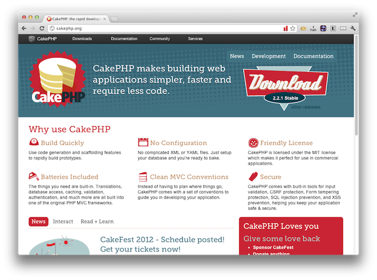
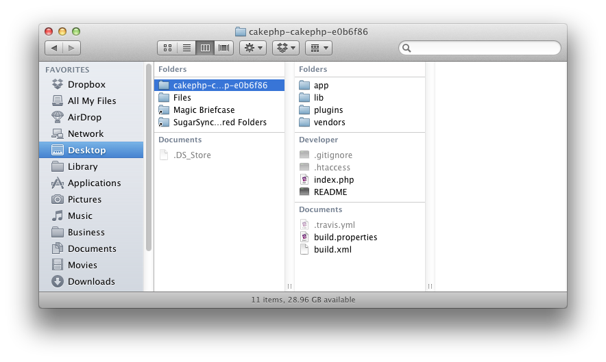

#Deploying Magento CE 1.7.0.2 to cloudControl

If you're looking for a fast, light and effective PHP Framework for your projects, you can't go past [Magento CE](http://framework.zend.com/). Now at [version 1.11](http://framework.zend.com/download/latest) it comes with a variety of features to speed up your application development, including:

 * Baked in Security
 * Clear MVC approach
 * A large, thriving, community
 * Loads of plugins and add-ons
 * Easy to read documentation

In this tutorial, we're going to take you through deploying Magento CE v2.2.1 to [the cloudControl platform](http://www.cloudcontrol.com). 

##Prerequisites

You're going to need only a few things to following along with this tutorial. These are:

 * A [Git client](http://git-scm.com/), whether command-line or GUI. If you're a GUI fan, there are some excellent options available. These include:
   * [GitX](http://gitx.frim.nl/)
   * [Github for Mac](http://mac.github.com/)
   * [Github for Windows](http://windows.github.com/)
   * [Gitbox](http://www.gitboxapp.com/)
   * [git-cola](http://git-cola.github.com/)
   * [Tower](http://www.git-tower.com/)
   * [TortoiseGit](http://code.google.com/p/gitextensions/)
 * A MySQL client, whether command-line or GUI, such as [MySQL Workbench](http://dev.mysql.com/downloads/workbench/) or the command-line tools.

##1. Grab a Copy of Magento CE 

So now that you have the prerequisites in place, download a copy of the latest, stable, release. You can find it at: [http://framework.zend.com/download/latest](http://framework.zend.com/download/latest). After that, extract it to your local file sytem. 

##Create a Basic Application

##2. Amend the Code

A few changes need to be made to the default Magento CE configuration and code to accommodate cloudControl deployment. These changes are as follows:

 * Store session and log files in a database, not on the filesystem
 * Auto-magically determine the environment and set the configuration

###2.1 Store Session and Log Files in a Database, Not on the Filesystem

We need to do this because Magento CE, by default, logs to and stores its session files on the filesystem. However, this approach isn't recommended on the cloudControl platform.

What's more, storing files in a multi-server environment can lead to hard to debug issues. So what we're going to do is to store both the session and log files in a two-level cache, composed of MySQL and APC. 

Thankfully, Magento CE is written in a very straight-forward and configurable manner, so this isn't too hard to do. What's more, the community around it is very healthy, so there's loads of options and support available. 

###2.2 Auto-magically Determine the Environment and Set the Configuration

As each environment will, likely, have different configuration settings, we also need to be able to differentiate between them. Magento CE does do this out of the box, but it's done by using different bootstrap files, such as **index.php**, **index-test.php** and so on. 

On cloudControl, an app should programmatically know where it is and set the appropriate configuration options. That way, your code will run in every environment. So we're going to be making additions to the code so this happens auto-magically.

##3. Put the Code Under Git Control

Ok, now let's get started making these changes and deploying the application. We'll begin by putting it under Git control. So run the following command to do that:

    cd <your Magento CE directory>
    
    git init .
    
    git add -A
    
    git commit -m "First addition of the source files"
    
Now that the code's under version control, we're going to create a testing branch as well, so that we have one to test with and one for production. Run the following command and it will be done:

    git checkout -b testing
    
If you're not familiar with Git, the previous command will checkout a copy of our existing branch, into a new branch, called *testing*. You can confirm that you now have two branches, by running the following command:

    git branch
    
That will show output similar to below:

    $ git branch
        master
        * testing

I am using the application name ``cloudcontroldlmag`` in this example. You will of course have to use some different name. 
Now, we need to make our first deployment of both branches to the cloudControl platform. To do this we checkout the master branch, create the application in our cloudControl account and push and deploy both deployments. By running the following commands, this will all be done:

    // switch to the master branch
    git checkout master
    
    // create the application
    cctrlapp cloudcontroldlmag create php
    
    // deploy the default branch
    cctrlapp cloudcontroldlmag/default push    
    cctrlapp cloudcontroldlmag/default deploy
    
    // deploy the testing branch
    cctrlapp cloudcontroldlmag/testing push    
    cctrlapp cloudcontroldlmag/testing deploy

##4. Initialise the Required Add-ons

Now that that's done, we need to configure two add-ons, config and mysqls. The config add-on's required for determining the active environment and mysqls for storing our session and logging information. 

###4.1 Check the Add-on Configuration

Now let's be sure that everything is in order by having a look at the add-on configuration output, in this case for testing. To do that, run the command below:

    // Initialise the mysqls.free addon for the default deployment
    cctrlapp cloudcontroldlmag/default addon.add mysql.free
    
    // Retrieve the settings
    cctrlapp cloudcontroldlmag/default addon mysql.free

    // Initialise the mysqls.free addon for the testing deployment
    cctrlapp cloudcontroldlmag/testing addon.add mysql.free
    
    // Retrieve the settings
    cctrlapp cloudcontroldlmag/testing addon mysql.free

The output of the commands will be similar to that below:

    Addon                    : mysqls.free
       
     Settings
       MYSQLS_DATABASE          : <database_name>
       MYSQLS_PASSWORD          : <database_password>
       MYSQLS_PORT              : 3306
       MYSQLS_HOSTNAME          : mysqlsdb.co8hm2var4k9.eu-west-1.rds.amazonaws.com
       MYSQLS_USERNAME          : <database_username>

###4.2 Initialising Config

Now we need to configure the config add-on and store the respective environment setting in it. So run the following commands to do this:

    // Set the default environment setting
    cctrlapp cloudcontroldlmag/default addon.add config.free --CAKE_ENV=production

    // Set the testing environment setting    
    cctrlapp cloudcontroldlmag/testing addon.add config.free --CAKE_ENV=testing

Now that this is done, we're ready to make some changes to our code to make use of the new configuration. 

##5. Environment Configuration

So firstly, we're going to extend the bootstrap process to be able to determine which environment is being used. Create a new file under ``Lib``, called ``BaseConfig.php`` and add in the code below. Have a look at it and we'll go through it together.

##6. Database Schema

Ok, next we need to create a basic database schema for storing both the session and log information. To save time, add the following to a SQL file called ``Magento CE_cloudcontrol_init.sql``, ready to be used to initialise the database next. 

    CREATE TABLE `cake_sessions` (
      `id` varchar(255) NOT NULL DEFAULT '',
      `data` text,
      `expires` int(11) DEFAULT NULL,
      PRIMARY KEY (`id`)
    ) ENGINE=MyISAM DEFAULT CHARSET=latin1;

Now, in the shell, we're going to load the data in to the remote mysql instance that we created earlier. To do so, run the following command, changing the respective options with your configuration settings, doing this for both default and testing:

    mysql -u <database_username> -p \
        -h mysqlsdb.co8hm2var4k9.eu-west-1.rds.amazonaws.com \
        --ssl-ca=mysql-ssl-ca-cert.pem <database_name> < Magento CE_cloudcontrol_init.sql

In the command above, you can see a reference to a **.pem** file. This can be downloaded from: [http://s3.amazonaws.com/rds-downloads/mysql-ssl-ca-cert.pem](http://s3.amazonaws.com/rds-downloads/mysql-ssl-ca-cert.pem). All being well, the command will finish silently, loading the data. You can check that all's gone well with following commands:

    mysql -u <database_username> -p \
        -h mysqlsdb.co8hm2var4k9.eu-west-1.rds.amazonaws.com \
        --ssl-ca=mysql-ssl-ca-cert.pem <database_name>
    
    show tables;
    
This will show you the tables from the SQL file. 

Now that that's done, commit the changes we made earlier and push and deploy both environments again so that the new information will be used. This can be done quickly with the following commands:

    // commit the changes
    git commit -m "changed to store log and session in mysql and auto-determine environment"

    // deploy the default branch
    cctrlapp cloudcontroldlmag/default push    
    cctrlapp cloudcontroldlmag/default deploy
    
    git checkout testing
    git merge master
    
    // deploy the testing branch
    cctrlapp cloudcontroldlmag/testing push    
    cctrlapp cloudcontroldlmag/testing deploy

##7. Review the Deployment

With that completed, then have a look at both your deployments to ensure that they're working. You can find these at the following urls:

| URL | Deployment |
| ------ | ------ |
|  [http://cloudcontroldlmag.cloudcontrolled.com](http://cloudcontroldlmag.cloudcontrolled.com)  |  Production  |
|  [http://testing.cloudcontroldlmag.cloudcontrolled.com](http://testing.cloudcontroldlmag.cloudcontrolled.com)  |  Testing  |

You should see output similar to that below, in figure 2.

###7.1 Deployment Problems

If you see output similar to figure 3, then double check your database configuration settings and run through commit and deploy again.

With that, you should be up and running, ready to create your next, amazing, PHP web application, using Magento CE. If you want to save yourself some time, you can clone a copy of the modified Magento CE source from the cloudControl Github repository. If you have any issues, feel free to email [support@cloudcontrol.com](mailto:support@cloudcontrol.com).
