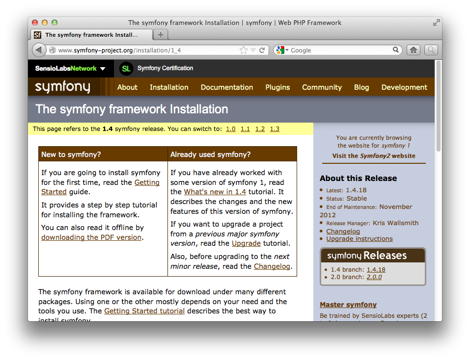
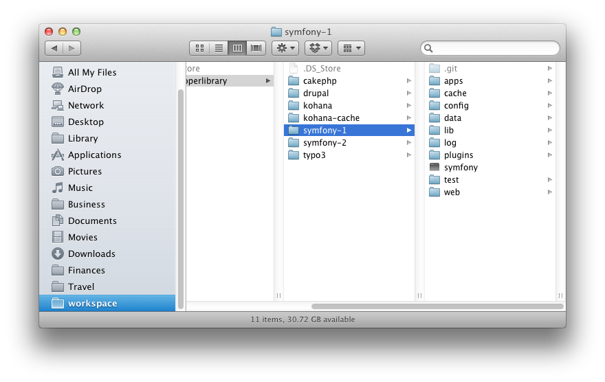
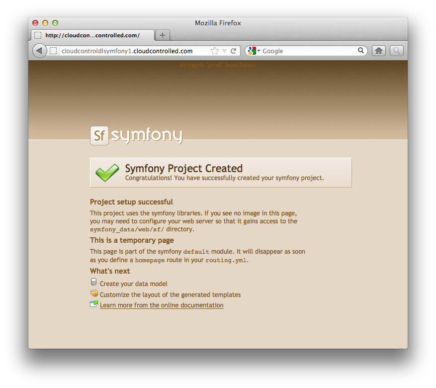

#Deploying Symfony 1.4 to cloudControl

If you're looking for a feature-rich, open source, PHP Framework for your projects complete with a strong community, large variety of plugins and add-ons and a strong history of active development, you can't go past [Symfony 1](http://symfony.com/). It comes with a variety of features to speed up your application development, including:

 * Database engine independent
 * Highly configurable
 * Enterprise ready
 * Easy to extend
 * Built-in internationalisation
 * Factories, plug-ins, and mixins
 * Built-in unit and functional testing framework

In this tutorial, we're going to take you through deploying CakePHP v2.2.1 to [the cloudControl platform](http://www.cloudcontrol.com). 

##Prerequisites

You're going to need only a few things to following along with this tutorial. These are:

 * A [Git client](http://git-scm.com/), whether command-line or GUI.
 * A MySQL client, whether command-line or GUI, such as [MySQL Workbench](http://dev.mysql.com/downloads/workbench/) or the command-line tools.

##1. Grab a Copy of Symfony

Now that you have the prerequisites in place, download a copy of the latest, stable, release of Symfony, **version 1.4** at the time or publishing. You can find it at: [http://www.symfony-project.org/installation/1_4](http://www.symfony-project.org/installation/1_4). After that, extract it to your local filesystem. 

##2. Amend the Code

As I mentioned before, a few changes need to be made to the default Symfony configuration. These changes are as follows:

 * Change the default [Cross-Site Request Forgery](https://www.owasp.org/index.php/Cross-Site_Request_Forgery_(CSRF)) (CSRF) secret key
 * Enable Propel instead of Doctrine
 * Store session and log files in a database
 * Auto-magically determine the environment and set the configuration

###2.1 Store Sessions in the Database & Disable Logging

We need to do this because Symfony, by default, logs to and stores its session files on the filesystem. However, this approach recommended on the cloudControl platform.

What's more, storing files in a multi-server environment can lead to hard to debug issues. So what we're going to do is to store sessions in the database and disable logging. 

Thankfully, Symfony is written in a very straight-forward and configurable manner, so this isn't too hard to do. What's more, the community around it is very healthy, so there's loads of options and support available. 

###2.2 Auto-magically determine the environment and set the configuration

As each environment will, likely, have different configuration settings, we also need to be able to differentiate between them. To keep it simple, what we need to do is to have one bootstrap file, across multiple deployments, and for it to programmatically know where it is and set the appropriate configuration options. So we're going to be making additions to the code so this happens.

##3. Put the Code under Git Control

Ok, now let's get started making these changes and deploying the application. We'll begin by putting it under Git control. So run the following command to do that:

    cd <your Symfony directory>
    
    git init .
    
    git add -A
    
    git commit -m "First addition of the source files"
    
Now that the code's under version control, we're going to create a testing branch as well, so that we have one to test with and one for production. Run the following command and it will be done:

    git checkout -b testing
    
If you're not familiar with Git, the previous command will checkout a copy of our existing branch, into a new branch, called ``testing``. You can confirm that you now have two branches, by running the following command:

    git branch
    
That will show output similar to below:

    $ git branch
        master
        * testing

I am using the application name ``cloudcontroldlsymfony`` in this example. You will of course have to use some different name. 
Now, we need to make our first deployment of both branches to the cloudControl platform. To do this we checkout the master branch, create the application in our cloudControl account and push and deploy both deployments. By running the following commands, this will all be done:

    // switch to the master branch
    git checkout master
    
    // create the application
    cctrlapp cloudcontroldlsymfony create php
    
    // deploy the default branch
    cctrlapp cloudcontroldlsymfony/default push    
    cctrlapp cloudcontroldlsymfony/default deploy
    
    // deploy the testing branch
    cctrlapp cloudcontroldlsymfony/testing push    
    cctrlapp cloudcontroldlsymfony/testing deploy

###3.1 Symfony Auto-Detected

When you do this, you'll see output similar to the following:

    $ cctrlapp cloudcontroldlsymfony/default push
    Counting objects: 15, done.
    Delta compression using up to 2 threads.
    Compressing objects: 100% (7/7), done.
    Writing objects: 100% (8/8), 1.23 KiB, done.
    Total 8 (delta 4), reused 0 (delta 0)
           
    >> Receiving push
    >> Compiling PHP
         INFO: Symfony 1.x detected
         INFO: No '.ccconfig.yaml' found, setting web content to '/web'.
    >> Building image
    >> Uploading image (3.0M)
           
    To ssh://cloudcontroldlsymfony@cloudcontrolled.com/repository.git
       d90506c..4078c78  master -> master

Note the following lines:

    INFO: Symfony 1.x detected
    INFO: No '.ccconfig.yaml' found, setting web content to '/web'.

In the previous version of the cloudControl platform, you would have had to have used a platform-specific config file called: ``.ccconfig.yaml`` and in it set the following:

    BaseConfig:
      WebContent: /web

However, beginning with the **luigi** stack, that's a thing of the past for a number of PHP frameworks, including Symfony 1.x because it auto-detects it and handles this for us. 

##4. Initialise the Required Add-ons

Now that that's done, we need to configure two add-ons, config and mysqls. The config Add-on is required for determining the active environment and mysqls for storing our session and logging information. 

###4.1 Initialising mysqls

To initialise mysqls, run the following commands and make a note of the output:

    // Initialise the mysqls.free addon for the default deployment
    cctrlapp cloudcontroldlsymfony/default addon.add mysql.free
    
    // Retrieve the settings
    cctrlapp cloudcontroldlsymfony/default addon mysql.free

    // Initialise the mysqls.free addon for the testing deployment
    cctrlapp cloudcontroldlsymfony/testing addon.add mysql.free
    
    // Retrieve the settings
    cctrlapp cloudcontroldlsymfony/testing addon mysql.free

The output of the commands will be similar to that below:

    Addon                    : mysqls.free
       
     Settings
       MYSQLS_DATABASE          : <database_username>
       MYSQLS_PASSWORD          : <database_password>
       MYSQLS_PORT              : 3306
       MYSQLS_HOSTNAME          : mysqlsdb.co8hm2var4k9.eu-west-1.rds.amazonaws.com
       MYSQLS_USERNAME          : <database_name>

###4.2 Initialising config

Now we need to configure the config addon and store the respective environment setting in it. So run the following commands to do this:

    // Set the default environment setting
    cctrlapp     cloudcontroldlsymfony/default config.add APPLICATION_ENV=production

    // Set the testing environment setting    
    cctrlapp     cloudcontroldlsymfony/testing config.add APPLICATION_ENV=testing

Now that this is done, we're ready to make some changes to our code to make use of the new configuration. 

##5. Environment Configuration

###5.1 Change the default Cross-Site Request Forgery (CSRF) Secret Key

In ``apps/frontend/config/settings.yml``, find the following configuration:

    # Form security secret (CSRF protection)
    csrf_secret:            83d9c79e8609e738e148c8ccd41113d5c5ddf301

If that's left in place, Symfony will throw an error. So we need to change it to a value that's unique for our environment. I've changed for the purposes of a simple example to the following:

    csrf_secret:            664914c3be95fc798d87a12ce4ea1610e2104d92

###5.2 Enable Propel instead of Doctrine

Now you don't necessarily need to do this. I've done it because I'm more comfortable with it. If you're a Doctrine guru, or just more comfortable with it, please skip this section.

In ``config/properties.ini``, look for the following line:

    orm=Doctrine
     
Change it to:

    orm=Propel

###5.3 Store Sessions in the Database

Under ``apps/frontend/config`` open the file ``factories.yaml``. In that file, we need to adding in session configuration for both prod and test. These are identified by ``prod:`` and ``test:`` respectively. For each one, add in a configuration similar to that below, changing the respective details where necessary:
    
      storage:
        class: sfCacheSessionStorage
        param:
          session_name: symfony1_cloudcontrol
          session_cookie_path: / 
          session_cookie_domain: cloudcontroldlsymfony.cloudcontrolled.com
          session_cookie_lifetime: +30 days
          session_cookie_secure: false 
          session_cookie_http_only: true
          cache:
            class: sfAPCCache 
            param: ~ 

What this has done is to tell Symfony to use the [sfCacheSessionStorage](http://www.symfony-project.org/api/1_4/sfCacheSessionStorage) to manage the session storage with the [sfAPCCache](http://www.symfony-project.org/api/1_4/sfAPCCache) class for physically storing the sessions. 

###5.4 Disable Logging

As we just did for session configuration, in factories.yaml, add in the following configuration, for prod and test, to disable logging:

      logger:
        class:   sfNoLogger
        param:
          level:   err
          loggers: ~

What this has done is to tell Symfony to use the [sfNoLogger](http://www.symfony-project.org/api/1_4/sfNoLogger) to manage logging, effectively throwing away the logs, like ``/dev/null`` on Linux/BSD. 

###5.5 Auto-Magically Determine the Environment and Set the Configuration

In the file ``web/index.php``, find the line that's similar to below:

    $configuration = ProjectConfiguration::getApplicationConfiguration(
        'frontend', 'prod', false
    );

And then replace it with the following

    $environment = 'prod';
    $debug = false;
    
    if (!empty($_SERVER['HTTP_HOST']) && strpos($_SERVER['HTTP_HOST'], 'localdomain') === FALSE) {
        // Parse the json file with ADDONS credentials
        $string = file_get_contents($_ENV['CRED_FILE'], false);
    
        if ($string == false) {
            die('FATAL: Could not read credentials file');
        }
    
        $creds = json_decode($string, true);
        $environment = $creds['CONFIG']['CONFIG_VARS']['CAKE_ENV'];
    } else {
        $environment = 'development';
    }
    
    if ($environment == 'development') {
        $debug = true;
    }
    
    $configuration = ProjectConfiguration::getApplicationConfiguration(
        'frontend', $environment, $debug
    );

What that will do is, if we're not using the local development environment, determined by having ``localdomain`` in the url, then we will retrieve a copy of the credentials file from the environment settings, that comes with every cloudControl application deployment by default. 

In there, we'll look for what the value of the **APPLICATION_ENV** config var is. If it's set, then we set the environment to be that. If it's not set, then we'll set the environment to ``prod``, so that we have a safe and sane default at all times.

###5.6 Database Configuration

In ``config/databases.yml`` by default, Symfony will have the following settings present:

    all:
      doctrine:
        class: sfDoctrineDatabase
    
What we're going to do is change it to have the values from our initialised mysqls.free add-on. So take the settings that you took note of earlier and change the file so that, with your settings, it looks similar to the configuration below:
    
    dev:
      propel:
        class: sfPropelDatabase
        param:
          classname: DebugPDO
          debug: { realmemoryusage: true, details: { time: { enabled: true }, slow: { enabled: true, threshold: 0.1 }, mem: { enabled: true }, mempeak: { enabled: true }, memdelta: { enabled: true } } }
          dsn: 'mysql:host=localhost;dbname=cloudcontrol_symfony1'
          username: cc_dev
          password: cc_dev
          encoding: utf8
          persistent: true
          pooling: true
    
    test:
      propel:
        class: sfPropelDatabase
         param:
          classname: PropelPDO
          debug: { realmemoryusage: true, details: { time: { enabled: true }, slow: { enabled: true, threshold: 0.1 }, mem: { enabled: true }, mempeak: { enabled: true }, memdelta: { enabled: true } } }
           dsn: 'mysql:host=mysqlsdb.co8hm2var4k9.eu-west-1.rds.amazonaws.com;dbname=<database_name>'
           username: <database_username>
           password: <database_password>
          encoding: utf8
          persistent: true
          pooling: true
    
    prod:
      propel:
        class: sfPropelDatabase
        param:
          classname: PropelPDO
          debug: { realmemoryusage: true, details: { time: { enabled: true }, slow: { enabled: true, threshold: 0.1 }, mem: { enabled: true }, mempeak: { enabled: true }, memdelta: { enabled: true } } }
          dsn: 'mysql:host=mysqlsdb.co8hm2var4k9.eu-west-1.rds.amazonaws.com;dbname=<database_name>'
          username: <database_username>
          password: <database_password>
          encoding: utf8
          persistent: true
          pooling: true
    
    all:

Please note that if you're using Doctrine, leave ``sfDoctrineDatabase`` in place instead of replacing it with ``sfPropelDatabase``.

After this, stage all the files in Git and commit them with a suitable commit message. Then commit the changes and push and deploy both environments again so that the new information will be used. This can be done quickly with the following commands:

    // commit the changes
    git commit -m "changed to store log and session in mysql and auto-determine environment"

    // deploy the default branch
    cctrlapp cloudcontroldlsymfony/default push    
    cctrlapp cloudcontroldlsymfony/default deploy
    
    git checkout testing
    git merge master
    
    // deploy the testing branch
    cctrlapp cloudcontroldlsymfony/testing push    
    cctrlapp cloudcontroldlsymfony/testing deploy

##7. Review the Deployment

With that completed, then have a look at both your deployments to ensure that they're working. 
You should see output similar to that below, in figure 2.

With that, you should be up and running, ready to create your next, amazing, PHP web application, using Symfony. If you have any issues, feel free to email [support@cloudcontrol.com](mailto:support@cloudcontrol.com).

##Links

 * [http://www.designdisclosure.com/2009/11/symfony-apc-cache-and-memcache-session-storage/](http://www.designdisclosure.com/2009/11/symfony-apc-cache-and-memcache-session-storage/)
