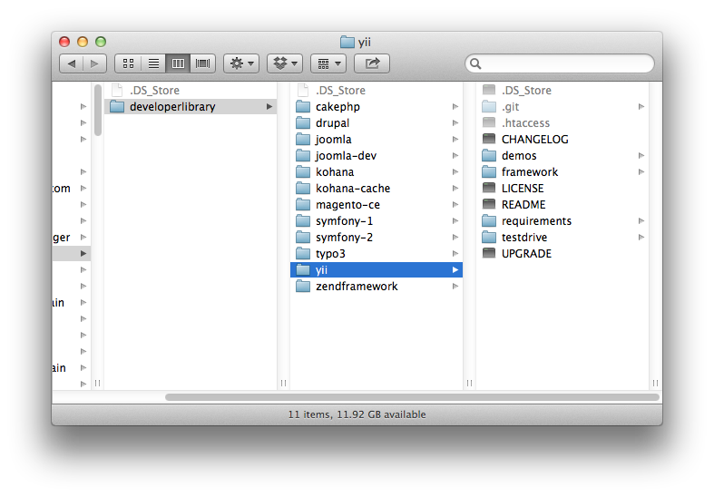
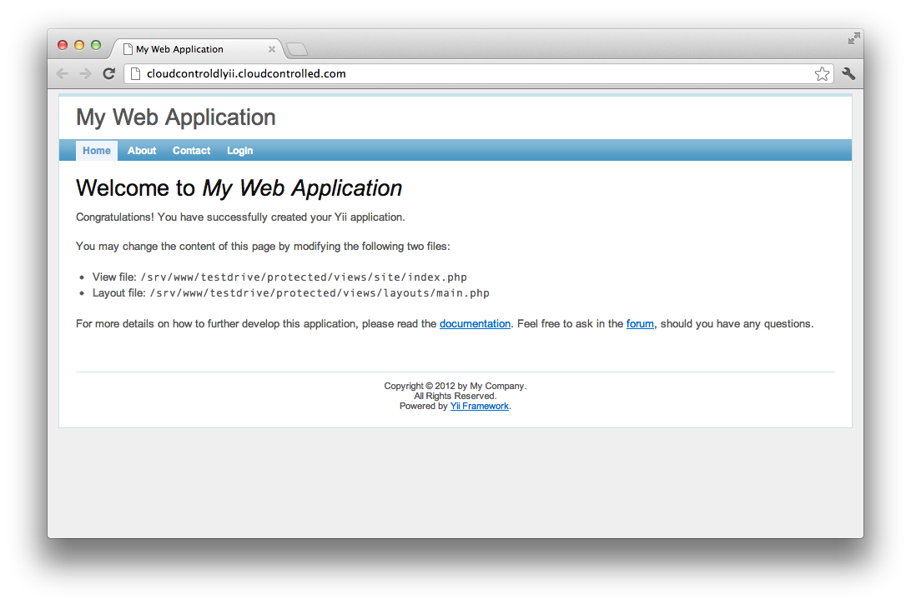

#Deploying Yii 1.1.10 to cloudControl

If you're looking for a lightning fast, light and effective PHP Framework for your projects, one without a lot of the cruft and legacy overhead of some of the other popular PHP frameworks available today, you can't go past [Yii Framework](http://www.yiiframework.com/). Now at [version 1.1.11](http://yii.googlecode.com/files/yii-1.1.11.58da45.tar.gz) it comes with a variety of features to speed up your application development, including:

 * Baked in Security
 * Clear MVC approach
 * A large, thriving, community
 * Loads of plugins and add-ons
 * Easy to read documentation

In this tutorial, we're going to take you through deploying the Yii Framework v1.1.11 to [the cloudControl platform](http://www.cloudcontrol.com).

##Prerequisites

You're going to need only a few things to following along with this tutorial. These are:

 * A [Git client](http://git-scm.com/), whether command-line or GUI.
 * A MySQL client, whether command-line or GUI, such as [MySQL Workbench](http://dev.mysql.com/downloads/workbench/) or the command-line tools.

##1. Grab a Copy of the Yii Framework 

So now that you have the prerequisites in place, download a copy of the latest, stable, release. You can find it at: [http://yii.googlecode.com/files/yii-1.1.11.58da45.tar.gz](http://yii.googlecode.com/files/yii-1.1.11.58da45.tar.gz). After that, extract it to your local file sytem. 

##Create a Basic Application

Ok, first things first, [follow the online tutorial](http://www.yiiframework.com/doc/guide/1.1/en/quickstart.installation) on the Yii site and create a simple application in your local development environment. Then, after you've done that, we're going to make a set of simple changes and you'll be ready to deploy your first application to cloudControl.

##2. Amend the Code

Ok, now that you have your test application created and running, we need to modify a few parts of the code. These changes are as follows:

 * Store session information in APC 
 * Log messages in the database, not on the filesystem
 * Auto-magically determine the environment and set the configuration

###2.1 Store Session in the Cache Log Files in a Database, Not on the Filesystem

We need to do this because Yii Framework, by default, logs to and stores its session files on the filesystem. However, this approach isn't recommended on the cloudControl platform.

What's more, storing files in a multi-server environment can lead to hard to debug issues. So what we're going to do is to store both the session and log files in a two-level cache, composed of MySQL and APC. 

Thankfully, Yii Framework is written in a very straight-forward and configurable manner, so this isn't too hard to do. What's more, the community around it is very healthy, so there's loads of options and support available. 

###2.2 Auto-magically Determine the Environment and Set the Configuration

As each environment will, likely, have different configuration settings, we also need to be able to differentiate between them. Yii Framework does do this out of the box, but it's done by using different bootstrap files, such as ``index.php``, ``index-test.php`` and so on. 

On cloudControl, an app should programmatically know where it is and set the appropriate configuration options. That way, your code will run in every environment. So we're going to be making additions to the code so this happens auto-magically.

##3. Put the Code Under Git Control

Ok, now let's get started making these changes and deploying the application. We'll begin by putting it under Git control. So run the following command to do that:

    cd <your Yii Framework directory>
    
    git init .
    
    git add -A
    
    git commit -m "First addition of the source files"
    
Now that the code's under version control, we're going to create a testing branch as well, so that we have one to test with and one for production. Run the following command and it will be done:

    git checkout -b testing
    
If you're not familiar with Git, the previous command will checkout a copy of our existing branch, into a new branch, called *testing*. You can confirm that you now have two branches, by running the following command:

    git branch
    
That will show output similar to below:

    $ git branch
        master
        * testing

I am using the application name ``cloudcontroldlyii`` in this example. You will of course have to use some different name. 
Now, we need to make our first deployment of both branches to the cloudControl platform. To do this we checkout the master branch, create the application in our cloudControl account and push and deploy both deployments. By running the following commands, this will all be done:

    // switch to the master branch
    git checkout master

    // create the application
    cctrlapp cloudcontroldlyii create php

    // deploy the default branch
    cctrlapp cloudcontroldlyii/default push
    cctrlapp cloudcontroldlyii/default deploy --stack luigi

    // deploy the testing branch
    cctrlapp cloudcontroldlyii/testing push
    cctrlapp cloudcontroldlyii/testing deploy --stack luigi

You should see output as below:

    $ cctrlapp cloudcontroldlyii/default push
    Counting objects: 2257, done.
    Delta compression using up to 2 threads.
    Compressing objects: 100% (2131/2131), done.
    Writing objects: 100% (2257/2257), 5.42 MiB | 117 KiB/s, done.
    Total 2257 (delta 735), reused 0 (delta 0)

    >> Receiving push
    >> Compiling PHP
         INFO: Yii Framework detected
         INFO: No '.ccconfig.yaml' found, setting web content to '/testdrive'.
         INFO: Required directory missing, creating 'testdrive/protected/runtime'.
    >> Building image
    >> Uploading image (4.1M)

    To ssh://cloudcontroldlyii@cloudcontrolled.com/repository.git
     * [new branch]      master -> master

##4. Initialise the Required Add-ons

Now that that's done, we need to configure two add-ons, config and mysqls. The config Add-on is required for determining the active environment and mysqls for storing our session and logging information. 

###4.1 Check the Add-on Configuration

Now let's be sure that everything is in order by having a look at the add-on configuration output, in this case for testing. To do that, run the command below:

    // Initialise the mysqls.free addon for the default deployment
    cctrlapp cloudcontroldlyii/default addon.add mysqls.free

    // Retrieve the settings
    cctrlapp cloudcontroldlyii/default addon mysqls.free

    // Initialise the mysqls.free addon for the testing deployment
    cctrlapp cloudcontroldlyii/testing addon.add mysqls.free

    // Retrieve the settings
    cctrlapp cloudcontroldlyii/testing addon mysqls.free

The output of the commands will be similar to that below:

    Addon                    : mysqls.free

     Settings
       MYSQLS_DATABASE          : <database_name>
       MYSQLS_PASSWORD          : <database_password>
       MYSQLS_PORT              : 3306
       MYSQLS_HOSTNAME          : mysqlsdb.co8hm2var4k9.eu-west-1.rds.amazonaws.com
       MYSQLS_USERNAME          : <database_username>

###4.2 Initialising config

Now we need to configure the config add-on and store the respective environment setting in it. So run the following commands to do this:

    // Set the default environment setting
    cctrlapp cloudcontroldlyii/default config.add APPLICATION_ENV=main

    // Set the testing environment setting
    cctrlapp cloudcontroldlyii/testing config.add APPLICATION_ENV=testing

Now that this is done, we're ready to make some changes to our code to make use of the new configuration.

##5. Environment Configuration

###5.1 Bootstrap

By default, Yii comes with 3 bootstrap configuration files. Located in ``<yourapp>/protected/config`` the files are called ``console.php``, ``main.php`` and ``test.php``. They are the *console*, *production* and *testing* environment configurations, respectively. 

We need to change them slightly so that they'll do what we need. Have a look at the code below that will show, specifically, what we need to change.

####5.1.1 Load the Settings from the Environment
 
We'll look specifically at main.php here, but you can change the other two files as well. We add the code below to the top of the file so that we are able to access the ``CRED_FILE`` variable. 

When we configured the add ons earlier (mysqls and config) the settings were automatically persisted to the running server environments. So we’re now able to retrieve these settings and configure our database connection to use them. It’s really handy as we don’t need to do too much to make use of the options.

    if (!empty($_SERVER['HTTP_HOST']) && strpos($_SERVER['HTTP_HOST'], 'localdomain') === FALSE) {
        // Parse the json file with ADDONS credentials
        $string = file_get_contents($_ENV['CRED_FILE'], false);
    
        if ($string == false) {
            die('FATAL: Could not read credentials file');
        }
    
        $creds = json_decode($string, true);
    }
    
####5.1.2 Enable the MySQL Database Configuration
    
With the ``CRED_FILE`` information available, we set the database name, username, password and hostname automatically, as below:
    
	'db'=>array(
		'connectionString' => 'mysql:host=' . $creds["MYSQLS"]["MYSQLS_HOSTNAME"] . ';dbname=' . $creds["MYSQLS"]["MYSQLS_DATABASE"],
		'emulatePrepare' => true,
		'username' => $creds["MYSQLS"]["MYSQLS_USERNAME"],
		'password' => $creds["MYSQLS"]["MYSQLS_PASSWORD"],
		'charset' => 'utf8',
	),
	
####5.1.3 Enable Database Logging
	
Now that the database is configured, we enable logging, with the CDbLogRoute class, specifying the connectionID to be that of our database, 'db'. Now, we have database logging enabled and ready. 

We also enable ``autoCreateLogTable``, which will create the database logging table automatically for us, if we don't initialise it with the SQL schema later. We're going to, but this way, you see that you don't have to as well as see the table schema. So whichever way you go, you're covered.

We're sticking with the default logging levels of error and warning. So if you want to have more levels enabled, please change this to suit your needs. 
	
	'log'=>array(
		'class'=>'CLogRouter',
		'routes'=>array(
			array(
				'class'=>'CDbLogRoute',
				'autoCreateLogTable' => 1,
				'connectionID' => 'db',
				'levels'=>'error, warning',
			),
		),
	),
	
You can find out more about the class in [the online documentation](http://www.yiiframework.com/doc/api/1.1/CDbLogRoute/).
	
####5.1.4 Enable Caching with APC
	
To enable caching of our applications, we then enable the 'cache' module using the ``system.caching.CApcCache`` class. With these done, we're just about ready to go.
	
	'cache'=>array(
        'class'=>'system.caching.CApcCache',
    ),

You can find out more about the class in [the online documentation](http://www.yiiframework.com/doc/api/1.1/CApcCache).

###5.3 index.php

Initially, ``index.php`` will use the ``main.php`` configuration file as so:

    $config = dirname(__FILE__) . '/protected/config/main.php';
    
But we need to change that based on the environment we're in, as determined by the *APPLICATION_ENV* value we set with the configs add-on. So change ``index.php`` to be as follows:

    if (!empty($_SERVER['HTTP_HOST']) && strpos($_SERVER['HTTP_HOST'], 'localdomain') === FALSE) {
        // Parse the json file with ADDONS credentials
        $string = file_get_contents($_ENV['CRED_FILE'], false);
    
        if ($string == false) {
            die('FATAL: Could not read credentials file');
        }
    
        $creds = json_decode($string, true);
    
        // Now getenv('APPLICATION_ENV') should work:
        $entryScript = $creds['CONFIG']['CONFIG_VARS']['APPLICATION_ENV'];
        
    } else {
        $entryScript = 'development';
    }
    
    $config = dirname(__FILE__) . '/protected/config/' . $entryScript . '.php';
    
Now, ``index.php`` will load the configuration file based on *APPLICATION_ENV* automatically for us.

##6. Database Schema

Ok, next we need to create a basic database schema for storing both the session and log information. To save time, add the following to a SQL file called ``Yii Framework_cloudcontrol_init.sql``, ready to be used to initialise the database next. 

    --
    -- Table structure for table `YiiLog`
    --
    
    DROP TABLE IF EXISTS `YiiLog`;
    /*!40101 SET @saved_cs_client     = @@character_set_client */;
    /*!40101 SET character_set_client = utf8 */;
    CREATE TABLE `YiiLog` (
      `id` int(11) NOT NULL AUTO_INCREMENT,
      `level` varchar(128) DEFAULT NULL,
      `category` varchar(128) DEFAULT NULL,
      `logtime` int(11) DEFAULT NULL,
      `message` text,
      PRIMARY KEY (`id`)
    ) ENGINE=MyISAM AUTO_INCREMENT=2 DEFAULT CHARSET=latin1;
    /*!40101 SET character_set_client = @saved_cs_client */;
    
    --
    -- Table structure for table `tbl_user`
    --
    
    DROP TABLE IF EXISTS `tbl_user`;
    /*!40101 SET @saved_cs_client     = @@character_set_client */;
    /*!40101 SET character_set_client = utf8 */;
    CREATE TABLE `tbl_user` (
      `id` int(11) NOT NULL AUTO_INCREMENT,
      `username` varchar(128) NOT NULL,
      `password` varchar(128) NOT NULL,
      `email` varchar(128) NOT NULL,
      PRIMARY KEY (`id`)
    ) ENGINE=MyISAM AUTO_INCREMENT=22 DEFAULT CHARSET=latin1;
    /*!40101 SET character_set_client = @saved_cs_client */;

Now, in the shell, we're going to load the data in to the remote mysql instance that we created earlier. To do so, run the following command, changing the respective options with your configuration settings, doing this for both default and testing:

    mysql -u <database_username> -p \
        -h mysqlsdb.co8hm2var4k9.eu-west-1.rds.amazonaws.com \
        --ssl-ca=mysql-ssl-ca-cert.pem <database_name> < Yii Framework_cloudcontrol_init.sql

In the command above, you can see a reference to a **.pem** file. This can be downloaded from: [http://s3.amazonaws.com/rds-downloads/mysql-ssl-ca-cert.pem](http://s3.amazonaws.com/rds-downloads/mysql-ssl-ca-cert.pem). All being well, the command will finish silently, loading the data. You can check that all's gone well with following commands:

    mysql -u <database_username> -p \
        -h mysqlsdb.co8hm2var4k9.eu-west-1.rds.amazonaws.com \
        --ssl-ca=mysql-ssl-ca-cert.pem <database_name>
    
    show tables;
    
This will show you the tables from the SQL file. 

Now that that's done, commit the changes we made earlier and push and deploy both environments again so that the new information will be used. This can be done quickly with the following commands:

    // commit the changes
    git commit -m "changed to store log and session in mysql and auto-determine environment"

    // deploy the default branch
    cctrlapp cloudcontroldlyii/default push    
    cctrlapp cloudcontroldlyii/default deploy --stack luigi
    
    git checkout testing
    git merge master
    
    // deploy the testing branch
    cctrlapp cloudcontroldlyii/testing push    
    cctrlapp cloudcontroldlyii/testing deploy --stack luigi

##7. Review the Deployment

With that completed, then have a look at both your deployments to ensure that they're working. 
You should see output similar to that below, in figure 2.

###7.1 Deployment Problems

If you have any issues deploying the Yii Framework application, then please consult the log files. There are, currently, two available, these are **deploy** and **error**. As the names suggest, deploy provides an overview of the deployment process and error shows any and all PHP errors to the extend allowed by your current logging level.

To view the information, run the following commands respectively:

####7.1.1 Deployment

    cctrlapp cloudcontroldlyii/default log deploy

####7.1.1 Errors

    cctrlapp cloudcontroldlyii/default log error

The commands output information in a [UNIX tail](http://en.wikipedia.org/wiki/Tail_%28Unix%29) like fashion. So just call them and cancel the commend when you are no longer interested in the output. 

##8. All done

With that, you should be up and running, ready to create your next, amazing, PHP web application, using Yii Framework. If you want to save yourself some time, you can clone a copy of the modified Yii Framework source from the cloudControl Github repository. If you have any issues, feel free to email [support@cloudcontrol.com](mailto:support@cloudcontrol.com).

##Links
 
 * [Yii Framework](http://www.yiiframework.com/)
 * [Yii on Wikipedia](http://en.wikipedia.org/wiki/Yii)
 * [Yii on Twitter](https://twitter.com/yiiframework)
 * [Learning Yii from Larry Ullman](http://www.larryullman.com/series/learning-the-yii-framework/)
 
