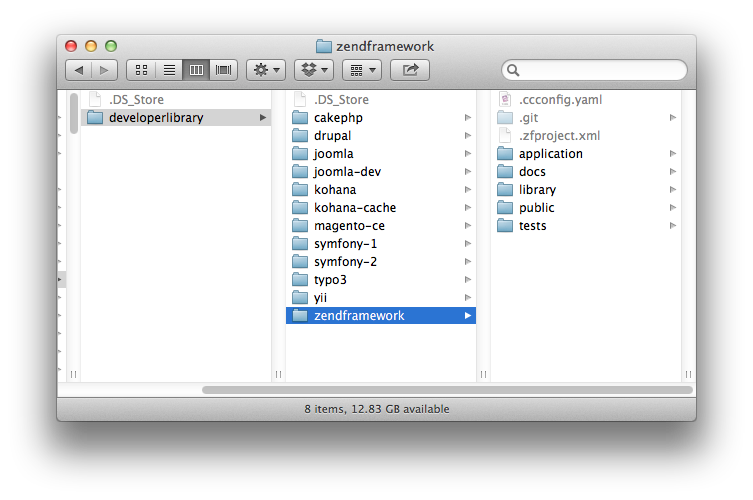
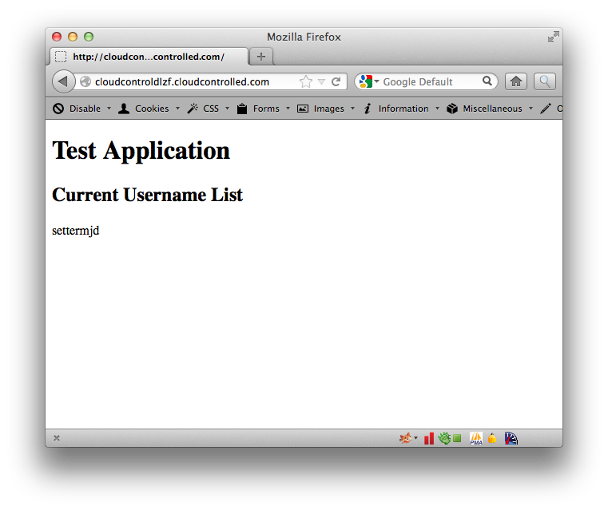

#Deploying Zend Framework 1.11 to cloudControl

If you're looking for a feature-rich, flexible and capable PHP Framework for your projects, you can't go past [Zend Framework](http://framework.zend.com/). Now at [version 1.11](http://framework.zend.com/download/latest) it comes with a variety of features to speed up your application development, including:

 * Straight-forward MVC approach
 * A large, thriving, community
 * Sub-library components for working with a range of services, including PayPal and Google
 * Easy to read documentation
 * A super, shiny, new version 2 **coming soon**

In this tutorial, we're going to take you through deploying Zend Framework v1.11 to [the cloudControl platform](http://www.cloudcontrol.com). 

##Prerequisites

You're going to need only a few things to following along with this tutorial. These are:

 * A [Git client](http://git-scm.com/), whether command-line or GUI.
 * A MySQL client, whether command-line or GUI, such as [MySQL Workbench](http://dev.mysql.com/downloads/workbench/) or the command-line tools.

##1. Grab a Copy of Zend Framework 

So now that you have the prerequisites in place, download a copy of the latest, stable, release. You can find it at: [http://framework.zend.com/download/latest](http://framework.zend.com/download/latest). After that, extract it to your local file system. 

##Create a Basic Application

After that, create a basic application by using zf.sh (or .bat) as follows:

    zf.sh create project test-application
    zf.sh enable layout

With that, you'll have a basic application that can be run in a basic VHost.

##2. Amend the Code

As I mentioned before, a few changes need to be made to the default application configuration and code to accommodate cloudControl deployment. These changes are as follows:

 * Store session and log files in a database, not on the filesystem
 * Auto-magically determine the environment and set the configuration

###2.1 Store Session and Log Files in a Database, Not on the Filesystem

Storing files in a multi-server environment can lead to hard to debug issues. So what we're going to do is to store both the session and log files in a two-level cache, composed of MySQL and APC. 

Thankfully, Zend Framework is written in a very straight-forward and configurable manner, so this isn't too hard to do. What's more, the community around it is very healthy, so there's loads of options and support available. 

###2.2 Auto-magically Determine the Environment and Set the Configuration

If we were deploying the application in a simple, configurable VHost, then we'd set an environment variable, such as ``APPLICATION_ENV`` in the webserver environment, which is then made available to PHP, similar to:

    <VirtualHost *:80>
        SetEnv APPLICATION_ENV development
    </VirtualHost>

When using cloudControl, we need to do this in a slightly different way. It involves, for each environment, setting an environment variable with the cctrlapp config add-on, then reading that information from the environment at runtime. We'll come to this shortly.

##3. Put the Code Under Git Control

Ok, now let's get started making these changes and deploying the application. We'll begin by putting it under Git control. So run the following command to do that:

    cd <your Zend Framework directory>
    
    git init .
    
    git add -A
    
    git commit -m "First addition of the source files"
    
Now that the code's under version control, we're going to create a testing branch as well, so that we have one to test with and one for production. Run the following command and it will be done:

    git checkout -b testing
    
If you're not familiar with Git, the previous command will checkout a copy of our existing branch, into a new branch, called *testing*. You can confirm that you now have two branches, by running the following command:

    git branch
    
That will show output similar to below:

    $ git branch
        master
        * testing

I am using the application name ``cloudcontroldlzf`` in this example. You will of course have to use some different name. 
Now, we need to make our first deployment of both branches to the cloudControl platform. To do this we checkout the master branch, create the application in our cloudControl account and push and deploy both deployments. By running the following commands, this will all be done:

    // switch to the master branch
    git checkout master
    
    // create the application
    cctrlapp cloudcontroldlzf create php
    
    // deploy the default branch
    cctrlapp cloudcontroldlzf/default push    
    cctrlapp cloudcontroldlzf/default deploy --stack luigi
    
    // deploy the testing branch
    cctrlapp cloudcontroldlzf/testing push    
    cctrlapp cloudcontroldlzf/testing deploy --stack luigi

You'll see output similar to the following:

    $ cctrlapp cloudcontroldlzf/testing push
    Total 0 (delta 0), reused 0 (delta 0)
           
    >> Receiving push
    >> Compiling PHP
         INFO: Zend Framework 1.x detected
    >> Building image
    >> Uploading image (3.6M)
           
    To ssh://cloudcontroldlzf@cloudcontrolled.com/repository.git
       dde253a..7b040e2  testing -> testing

In the output above, you'll see ``INFO: Zend Framework 1.x detected``. This is the latest stack auto-identifying that the application we're deploying is based on the Zend Framework and will take care of ensuring it sees /public as the root directory to find the bootstrap file, ``index.php``, in.

##4. Initialise the Required Add-ons

Now that that's done, we need to configure two add-ons, config and mysqls. The config add-on is required for determining the active environment and mysqls for storing our session and logging information. 

###4.1 Check the Add-on Configuration

Now let's be sure that everything is in order by having a look at the add-on configuration output, in this case for testing. To do that, run the command below:

    // Initialise the mysqls.free addon for the default deployment
    cctrlapp cloudcontroldlzf/default addon.add mysqls.free
    
    // Retrieve the settings
    cctrlapp cloudcontroldlzf/default addon mysqls.free

    // Initialise the mysqls.free addon for the testing deployment
    cctrlapp cloudcontroldlzf/testing addon.add mysqls.free
    
    // Retrieve the settings
    cctrlapp cloudcontroldlzf/testing addon mysqls.free

The output of the commands will be similar to that below:

    Addon                    : mysqls.free
       
     Settings
       MYSQLS_DATABASE          : <database_name>
       MYSQLS_PASSWORD          : <database_password>
       MYSQLS_PORT              : 3306
       MYSQLS_HOSTNAME          : mysqlsdb.co8hm2var4k9.eu-west-1.rds.amazonaws.com
       MYSQLS_USERNAME          : <database_username>

###4.2 Initialising config

Now we need to configure the config add-on and store the respective environment setting in it. So run the following commands to do this:

    // Set the default environment setting
    cctrlapp cloudcontroldlzf/default config.add APPLICATION_ENV=production

    // Set the testing environment setting
    cctrlapp cloudcontroldlzf/testing config.add APPLICATION_ENV=testing

Now that this is done, we're ready to make some changes to our code to make use of the new configuration. 

##5. Environment Configuration

###5.1 application.ini

In the ini file, below, we've laid out the core configuration, which will be inherited by all environments by default. You can see that the params have been left blank. This is because they're required. But you'll see in the plugin resource, later, that we set them appropriately. 

    [production]
    phpSettings.display_startup_errors = 1
    phpSettings.display_errors = 1
    resources.frontController.params.displayExceptions = 1

####5.1.1 Database 
    
    ; Configure Database settings
    resources.db.adapter = PDO_MYSQL
    resources.db.isDefaultTableAdapter = true
    resources.db.params.host = 
    resources.db.params.username = 
    resources.db.params.password = 
    resources.db.params.dbname = 

####5.1.2 Session Storage
    
In the section below, we've configured the session to be saved with the [Zend_Session_SaveHandler_DbTable](http://framework.zend.com/manual/en/zend.session.savehandler.dbtable.html) class. The table schema will be provided shortly. This uses the default database adapter to connect to the database, so no further configuration will be required on our part to make this work properly.
    
    ; Configure Zend_Session_SaveHandler_DbTable:
    resources.session.savehandler.class = "Zend_Session_SaveHandler_DbTable"
    resources.session.savehandler.options.name = "session"
    resources.session.savehandler.options.primary = "id"
    resources.session.savehandler.options.modifiedColumn = "modified"
    resources.session.savehandler.options.dataColumn = "data"
    resources.session.savehandler.options.lifetimeColumn = "lifetime"

####5.1.3 Caching

In the section below, we've setup a simple cache option which we can use within the application. It has a simple set of frontend options and uses APC as the backend. As per the manual, we could also store the information in the backend, but for the purposes of this tutorial, APC will work just fine.
    
    ; Configure the frontend core caching option
    resources.cachemanager.general.frontend.name = Core
    resources.cachemanager.general.frontend.options.caching = true
    resources.cachemanager.general.frontend.options.cache_id_prefix = NULL
    resources.cachemanager.general.frontend.options.lifetime = 3600
    resources.cachemanager.general.frontend.options.logging = false
    resources.cachemanager.general.frontend.options.write_control = true
    resources.cachemanager.general.frontend.options.automatic_serialization = true
    resources.cachemanager.general.frontend.options.automatic_cleaning_factor = 10
    resources.cachemanager.general.frontend.options.ignore_user_abort = false
    
    ; Configure a simple APC cache
    resources.cachemanager.general.backend.name = Apc

###5.2 Bootstrap Plugin Resources

Ok, let's start looking over the bootstrap plugin resources that will help us complete the setup of our application.
    
####5.2.1 Database
    
In the database configuration, if we're **not** in the local development environment, we need to consult the ``CRED_FILE`` variable, available in all cloudControl environments, for the options for mysql. 

When we configured the add ons earlier (**mysqls** and **config**) the settings were automatically persisted to the running server environments. So we’re now able to retrieve these settings and configure our database connection to make use of them. 

It’s really handy as we don’t need to do too much to make use of the options. To do this, we get a handle on the partly-configured database adapter and supplement the settings by calling the ``setParams`` method. Have a look through the code for the resource below to see how it works.
    
        protected function _initDb()
        {
            // 
            // Get a handle on the existing db plugin resource
            //   
            $dbPluginResource = $this->getPluginResource('db');
            
            if (APPLICATION_ENV !=='development') {
                
                //
                // Read the environment credentials file
                //
                $string = file_get_contents($_ENV['CRED_FILE'], false);
                if ($string == false) {
                    die('FATAL: Could not read credentials file');
                }

                //
                // Decode them from JSON
                //
                $creds = json_decode($string, true);
                
                //
                // Set the missing database settings with the retrieved options.
                //
                $dbPluginResource->setParams(array(
                    'dbname' => $creds["MYSQLS"]["MYSQLS_DATABASE"],
                    'host' => $creds["MYSQLS"]["MYSQLS_HOSTNAME"],
                    'username' => $creds["MYSQLS"]["MYSQLS_USERNAME"],
                    'password' => $creds["MYSQLS"]["MYSQLS_PASSWORD"],
                ));
            }
            
            //
            // Set the fetch mode and store the resource in the app registry
            //
            if (!is_null($dbPluginResource)) {
                $db = $this->getPluginResource('db')->getDbAdapter();
                $db->setFetchMode(Zend_Db::FETCH_OBJ);
                Zend_Db_Table::setDefaultAdapter($db);
                Zend_Registry::set('db', $db);
                return $db;
            }
            
            return FALSE;
        }
 
With this, we'll have a working database configuration.
    
####5.2.2 Logging

Despite the flexibility of the Zend Framework application.ini file, it doesn't have support for configuring database-based logging. So we need to do it in a plugin resource. You can see below that we get the application database adapter and then use it when initialising a new [Zend_Log_Writer_Db](http://framework.zend.com/manual/en/zend.log.writers.html#zend.log.writers.database) class. 
    
        protected function _initLog() 
        {
            //
            // Get a handle on the db plugin resource
            //
            $dbPluginResource = $this->getPluginResource('db');
            
            if (!is_null($dbPluginResource)) {
                $db = $this->getPluginResource('db')->getDbAdapter();
                
                // 
                // Create a new Zend_Log_Writer_Db writer
                //
                $dbWriter = new Zend_Log_Writer_Db($db, 'log_table');
    
                //
                // Register it with the logger
                //
                $logger = new Zend_Log($dbWriter);
                
                //
                // Store that in the registry
                //
                Zend_Registry::set('logger', $logger);
                return $logger;
            }
        }
       
####5.2.3 Caching

This is more of a utility method, for convenience within the application. We make the general ``cachemanager`` object we initialised in the application.ini file earlier available through a plugin resource.
        
    protected function _initCache()
    {
        try {
            $bootstrapCacheMgr = $this->bootstrap('cachemanager');
        } catch (Zend_Application_Bootstrap_Exception $e) {
            // log error...
        }

        if (!empty($bootstrapCacheMgr) && $bootstrapCacheMgr instanceof 
            Zend_Application_Bootstrap_BootstrapAbstract && 
            $bootstrapCacheMgr->hasResource('cachemanager')) 
        {
        
            //
            // Get a handle on the existing cache manager
            //
            $cacheManager = $bootstrapCacheMgr->getResource('cachemanager');
            $generalCache = 'general';
            
            if ($cacheManager->hasCache($generalCache)) {
                $cache = $cacheManager->getCache($generalCache);
                // Only attempt to cache the metadata if we have a cache available
                if (!empty($cache)) {
                    try {
                        Zend_Registry::set('cache', $cache);
                        return $cache;
                    } catch(Zend_Db_Table_Exception $e) {
                        // log error...
                    }
                }
            }
        }
    }
   
###5.3 index.php

We then need to make an adjustment to the default ``index.php`` that comes with a standard Zend Framework installation, as created by ``zf.sh`` (or bat).

Normally it looks like the below (formatted for readability):

    // Define path to application directory
    defined('APPLICATION_PATH')
        || define('APPLICATION_PATH', realpath(dirname(__FILE__) . '/../application'));
    
    // Define path to application directory
    defined('PROJECT_PATH')
        || define('PROJECT_PATH', realpath(dirname(__FILE__) . '/../'));
    
    // Define application environment
    defined('APPLICATION_ENV')
        || define('APPLICATION_ENV', 
            (getenv('APPLICATION_ENV') 
            ? getenv('APPLICATION_ENV') : 'production'));

However, we need to make a small change, as highlighted below:

    // Define path to application directory
    defined('APPLICATION_PATH')
        || define('APPLICATION_PATH', realpath(dirname(__FILE__) . '/../application'));
    
    if (!empty($_SERVER['HTTP_HOST']) && strpos($_SERVER['HTTP_HOST'], 'localdomain') === FALSE) {
        // Parse the json file with ADDONS credentials
        $string = file_get_contents($_ENV['CRED_FILE'], false);
    
        if ($string == false) {
            die('FATAL: Could not read credentials file');
        }
    
        $creds = json_decode($string, true);
    
        // Now getenv('APPLICATION_ENV') should work:
        $environment = $creds['CONFIG']['CONFIG_VARS']['APPLICATION_ENV'];
    
        switch($environment) 
        {
            case ('testing'):
               define('APPLICATION_ENV', 'testing');
            break;
    
            case ('staging'):
               define('APPLICATION_ENV', 'staging');
            break;
    
            case ('production'):
            default:
                define('APPLICATION_ENV', 'production');
        }
    } else {
        define('APPLICATION_ENV', 'development');
    }
    
    // Define application environment
    defined('APPLICATION_ENV') || define('APPLICATION_ENV', 'production');

What that does is to use the ``CRED_FILE`` settings that we configured earlier to help us determine the environment, ``APPLICATION_ENV``, that the application's operating within. 

##6. Database Schema

Ok, next we need to create a basic database schema for storing both the session and log information. To save time, add the following to a SQL file called ``zendframework_cloudcontrol_init.sql``, ready to be used to initialise the database next. 

    -- table structure
    CREATE TABLE `session` (
      `id` char(32),
      `modified` int,
      `lifetime` int,
      `data` text,
      PRIMARY KEY (`id`)
    );
    
    CREATE TABLE `log_table` (
        `priority` varchar(50) default NULL,
        `message` varchar(100) default NULL,
        `timestamp` timestamp NOT NULL default CURRENT_TIMESTAMP on update CURRENT_TIMESTAMP,
        `priorityName` varchar(40) default NULL
    ) ENGINE=InnoDB DEFAULT CHARSET=latin1;
    
    CREATE TABLE `tbl_users` (
        `first` varchar(50) default NULL,
        `last` varchar(100) default NULL,
        `username` varchar(40) default NULL
    ) ENGINE=InnoDB;
    
    -- add some records
    INSERT INTO tbl_users(first, last, username) VALUES('matthew', 'setter', 'settermjd');

Now, in the shell, we're going to load the data in to the remote mysql instance that we created earlier. To do so, run the following command, changing the respective options with your configuration settings, doing this for both default and testing:

    mysql -u <database_username> -p \
        -h mysqlsdb.co8hm2var4k9.eu-west-1.rds.amazonaws.com \
        --ssl-ca=mysql-ssl-ca-cert.pem <database_name> < zendframework_cloudcontrol_init.sql

In the command above, you can see a reference to a **.pem** file. This can be downloaded from: [http://s3.amazonaws.com/rds-downloads/mysql-ssl-ca-cert.pem](http://s3.amazonaws.com/rds-downloads/mysql-ssl-ca-cert.pem). All being well, the command will finish silently, loading the data. You can check that all's gone well with following commands:

    mysql -u <database_username> -p \
        -h mysqlsdb.co8hm2var4k9.eu-west-1.rds.amazonaws.com \
        --ssl-ca=mysql-ssl-ca-cert.pem <database_name>
    
    show tables;
    
This will show you the tables from the SQL file. 

Now that that's done, commit the changes we made earlier and push and deploy both environments again so that the new information will be used. This can be done quickly with the following commands:

    // commit the changes
    git commit -m "changed to store log and session in mysql and auto-determine environment"

    // deploy the default branch
    cctrlapp cloudcontroldlzf/default push    
    cctrlapp cloudcontroldlzf/default deploy --stack luigi
    
    git checkout testing
    git merge master
    
    // deploy the testing branch
    cctrlapp cloudcontroldlzf/testing push    
    cctrlapp cloudcontroldlzf/testing deploy --stack luigi

##7. Review the Deployment

With that completed, then have a look at both your deployments to ensure that they're working. 

You should see output similar to that below, in figure 2.

###7.1 Deployment Problems

If you have any issues deploying the Zend Framework application, then please consult the log files. There are, currently, two available, these are **deploy** and **error**. As the names suggest, deploy provides an overview of the deployment process and error shows any and all PHP errors to the extend allowed by your current logging level.

To view the information, run the following commands respectively:

####7.1.1 Deployment

    cctrlapp cloudcontroldlzf/default log deploy

####7.1.1 Errors

    cctrlapp cloudcontroldlzf/default log error

The commands output information in a [UNIX tail](http://en.wikipedia.org/wiki/Tail_%28Unix%29) like fashion. So just call them and cancel the commend when you are no longer interested in the output. 

##Links
 
 * [Zend_Log_Writer_Db - Customising table columns](http://www.webeks.net/php/zend-log-writer-db-customising-table-columns.html)
 * [Logging in Zend Framework (Zend_Log & Zend_Log_Writer_Db)](http://mnshankar.wordpress.com/tag/zend_log_writer_db/)
